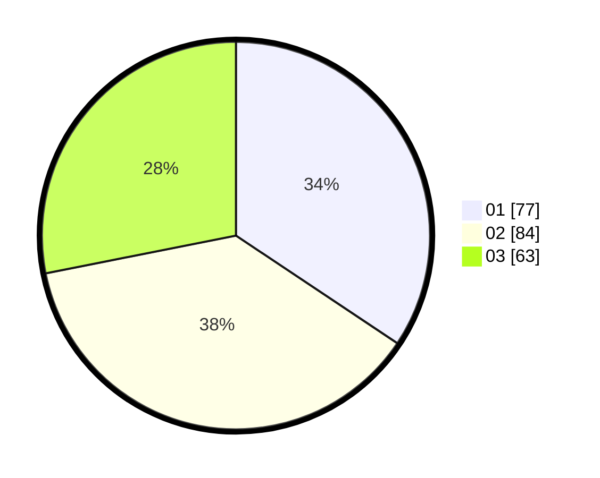

# Hasil

Hasil perolehan suara paslon dapat dilihat pada file paslon-01.txt, paslon-02.txt, dan paslon-03.txt.

Jika tidak ada, artinya data tersebut belum ada pada SIREKAP.

## Perolehan Suara

 * Paslon 01: **77**.
 * Paslon 02: **84**.
 * Paslon 03: **63**.

## Foto C Plano

https://sirekap-obj-formc.kpu.go.id/2a3c/pemilu/ppwp/31/74/08/10/01/3174081001048-20240218-092313--8836b64a-d2ac-4c0f-82b2-68d61921d2e7.jpg

https://sirekap-obj-formc.kpu.go.id/2a3c/pemilu/ppwp/31/74/08/10/01/3174081001048-20240218-120457--aac80d06-5aca-47eb-b899-4fd9385324a0.jpg

https://sirekap-obj-formc.kpu.go.id/2a3c/pemilu/ppwp/31/74/08/10/01/3174081001048-20240218-093503--76162e08-6483-462f-b0c3-1fdbe3df5108.jpg

## DATA PEMILIH TETAP

Jumlah pemilih dalam DPT: **273**.
 * L: **126**.
 * P: **147**.

## DATA PENGGUNA HAK PILIH

Jumlah pengguna hak pilih dalam DPT: **214**.
 * L: **97**.
 * P: **117**.

Jumlah pengguna hak pilih dalam DPTb: **10**.
 * L: **9**.
 * P: **1**.

Jumlah pengguna hak pilih dalam DPK: **3**.
 * L: **1**.
 * P: **2**.

Jumlah pengguna hak pilih: **227**.
 * L: **107**.
 * P: **120**.

## JUMLAH SUARA SAH DAN TIDAK SAH

JUMLAH SELURUH SUARA SAH: **224**.

JUMLAH SUARA TIDAK SAH: **3**.

JUMLAH SELURUH SUARA SAH DAN SUARA TIDAK SAH: **227**.
