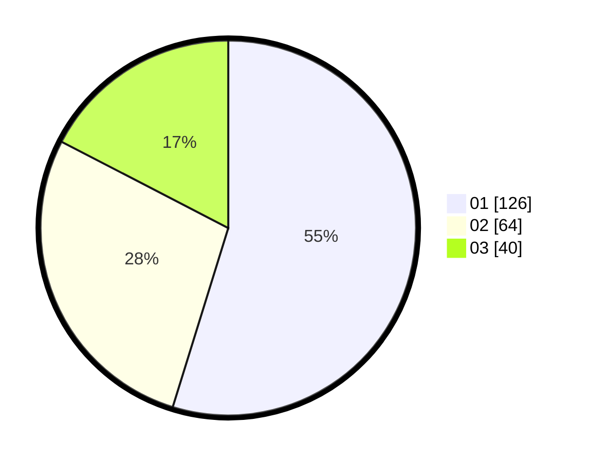

# Hasil

Hasil perolehan suara paslon dapat dilihat pada file paslon-01.txt, paslon-02.txt, dan paslon-03.txt.

Jika tidak ada, artinya data tersebut belum ada pada SIREKAP.

## Perolehan Suara

 * Paslon 01: **126**.
 * Paslon 02: **64**.
 * Paslon 03: **40**.

## Foto C Plano

https://sirekap-obj-formc.kpu.go.id/c5f0/pemilu/ppwp/31/74/08/10/01/3174081001052-20240217-235637--2ed2a219-cc8f-4a8a-b5f9-de8a3c868f77.jpg

https://sirekap-obj-formc.kpu.go.id/c5f0/pemilu/ppwp/31/74/08/10/01/3174081001052-20240217-235813--6137ec37-0c0f-4749-adec-1a0dd6eb49e3.jpg

https://sirekap-obj-formc.kpu.go.id/c5f0/pemilu/ppwp/31/74/08/10/01/3174081001052-20240217-235948--6c72035b-bdbc-46f5-9aee-643e6a4c0127.jpg

## DATA PEMILIH TETAP

Jumlah pemilih dalam DPT: **271**.
 * L: **134**.
 * P: **137**.

## DATA PENGGUNA HAK PILIH

Jumlah pengguna hak pilih dalam DPT: **219**.
 * L: **108**.
 * P: **111**.

Jumlah pengguna hak pilih dalam DPTb: **9**.
 * L: **1**.
 * P: **8**.

Jumlah pengguna hak pilih dalam DPK: **3**.
 * L: **2**.
 * P: **1**.

Jumlah pengguna hak pilih: **231**.
 * L: **111**.
 * P: **120**.

## JUMLAH SUARA SAH DAN TIDAK SAH

JUMLAH SELURUH SUARA SAH: **230**.

JUMLAH SUARA TIDAK SAH: **1**.

JUMLAH SELURUH SUARA SAH DAN SUARA TIDAK SAH: **231**.
