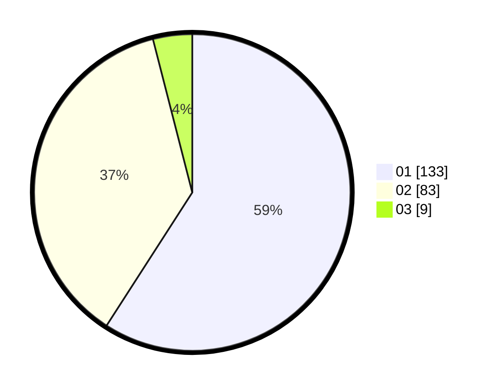

# Hasil

Hasil perolehan suara paslon dapat dilihat pada file paslon-01.txt, paslon-02.txt, dan paslon-03.txt.

Jika tidak ada, artinya data tersebut belum ada pada SIREKAP.

## Perolehan Suara

 * Paslon 01: **133**.
 * Paslon 02: **83**.
 * Paslon 03: **9**.

## Foto C Plano

https://sirekap-obj-formc.kpu.go.id/0d5e/pemilu/ppwp/31/74/08/10/01/3174081001060-20240217-213516--1467ba1c-34f0-4a90-8528-6745707046f6.jpg

https://sirekap-obj-formc.kpu.go.id/0d5e/pemilu/ppwp/31/74/08/10/01/3174081001060-20240217-214013--7ee18671-7ee5-4fcb-9030-472380fafa8f.jpg

https://sirekap-obj-formc.kpu.go.id/0d5e/pemilu/ppwp/31/74/08/10/01/3174081001060-20240217-214350--0e10dc24-ef8b-4ea9-936a-441b0f29c238.jpg

## DATA PEMILIH TETAP

Jumlah pemilih dalam DPT: **269**.
 * L: **130**.
 * P: **139**.

## DATA PENGGUNA HAK PILIH

Jumlah pengguna hak pilih dalam DPT: **229**.
 * L: **105**.
 * P: **119**.

Jumlah pengguna hak pilih dalam DPTb: **3**.
 * L: **3**.
 * P: **0**.

Jumlah pengguna hak pilih dalam DPK: **0**.
 * L: **0**.
 * P: **0**.

Jumlah pengguna hak pilih: **227**.
 * L: **108**.
 * P: **219**.

## JUMLAH SUARA SAH DAN TIDAK SAH

JUMLAH SELURUH SUARA SAH: **225**.

JUMLAH SUARA TIDAK SAH: **2**.

JUMLAH SELURUH SUARA SAH DAN SUARA TIDAK SAH: **227**.
