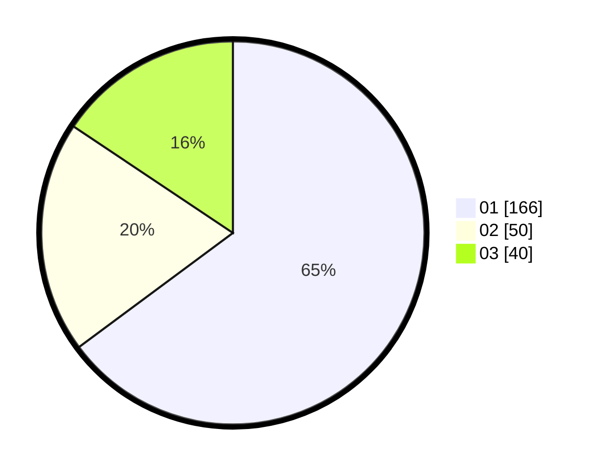

# Hasil

Hasil perolehan suara paslon dapat dilihat pada file paslon-01.txt, paslon-02.txt, dan paslon-03.txt.

Jika tidak ada, artinya data tersebut belum ada pada SIREKAP.

## Perolehan Suara

 * Paslon 01: **166**.
 * Paslon 02: **50**.
 * Paslon 03: **40**.

## Foto C Plano

https://sirekap-obj-formc.kpu.go.id/c028/pemilu/ppwp/31/74/08/10/01/3174081001061-20240217-184516--6a64bec4-af19-41d1-8fa7-1c3a7f7841fe.jpg

https://sirekap-obj-formc.kpu.go.id/c028/pemilu/ppwp/31/74/08/10/01/3174081001061-20240217-185901--4a481831-f15f-4bf5-98dc-bf56aec5b79b.jpg

https://sirekap-obj-formc.kpu.go.id/c028/pemilu/ppwp/31/74/08/10/01/3174081001061-20240217-184922--0899ea4c-78ba-43d1-9c8c-2ca4af0843c4.jpg

## DATA PEMILIH TETAP

Jumlah pemilih dalam DPT: **259**.
 * L: **131**.
 * P: **128**.

## DATA PENGGUNA HAK PILIH

Jumlah pengguna hak pilih dalam DPT: **216**.
 * L: **106**.
 * P: **110**.

Jumlah pengguna hak pilih dalam DPTb: **8**.
 * L: **3**.
 * P: **5**.

Jumlah pengguna hak pilih dalam DPK: **2**.
 * L: **0**.
 * P: **2**.

Jumlah pengguna hak pilih: **226**.
 * L: **109**.
 * P: **117**.

## JUMLAH SUARA SAH DAN TIDAK SAH

JUMLAH SELURUH SUARA SAH: **226**.

JUMLAH SUARA TIDAK SAH: **0**.

JUMLAH SELURUH SUARA SAH DAN SUARA TIDAK SAH: **226**.
