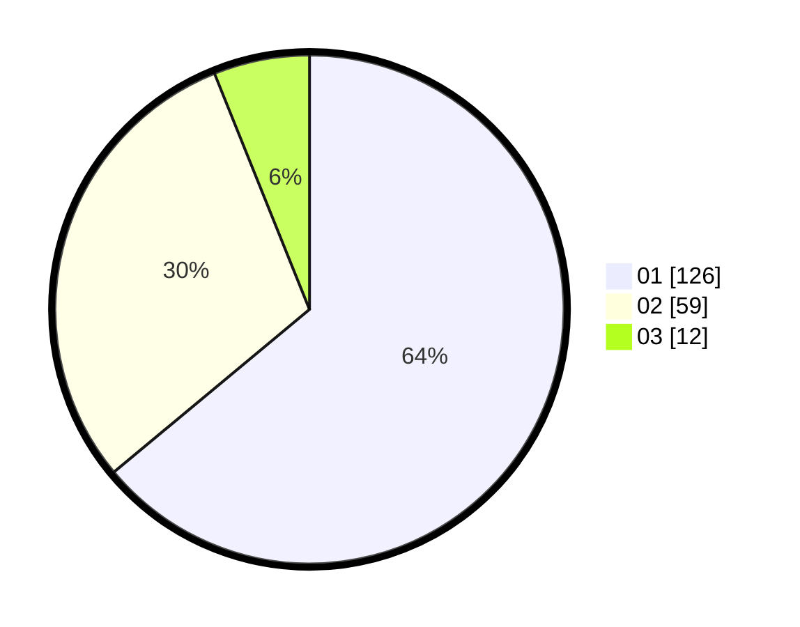

# Hasil

Hasil perolehan suara paslon dapat dilihat pada file paslon-01.txt, paslon-02.txt, dan paslon-03.txt.

Jika tidak ada, artinya data tersebut belum ada pada SIREKAP.

## Perolehan Suara

 * Paslon 01: **126**.
 * Paslon 02: **59**.
 * Paslon 03: **12**.

## Foto C Plano

https://sirekap-obj-formc.kpu.go.id/53e6/pemilu/ppwp/31/74/08/10/01/3174081001062-20240216-100055--b817b06f-55cc-4e23-97d9-55f7bf005e88.jpg

https://sirekap-obj-formc.kpu.go.id/53e6/pemilu/ppwp/31/74/08/10/01/3174081001062-20240216-100434--97c15c0e-c0aa-4c95-8ccd-dfb3343c8737.jpg

https://sirekap-obj-formc.kpu.go.id/53e6/pemilu/ppwp/31/74/08/10/01/3174081001062-20240216-100956--1d547467-ea5e-42b2-ab3b-5205e17aadce.jpg

## DATA PEMILIH TETAP

Jumlah pemilih dalam DPT: **225**.
 * L: **111**.
 * P: **114**.

## DATA PENGGUNA HAK PILIH

Jumlah pengguna hak pilih dalam DPT: **183**.
 * L: **85**.
 * P: **98**.

Jumlah pengguna hak pilih dalam DPTb: **13**.
 * L: **10**.
 * P: **3**.

Jumlah pengguna hak pilih dalam DPK: **2**.
 * L: **2**.
 * P: **0**.

Jumlah pengguna hak pilih: **198**.
 * L: **97**.
 * P: **101**.

## JUMLAH SUARA SAH DAN TIDAK SAH

JUMLAH SELURUH SUARA SAH: **197**.

JUMLAH SUARA TIDAK SAH: **1**.

JUMLAH SELURUH SUARA SAH DAN SUARA TIDAK SAH: **198**.
