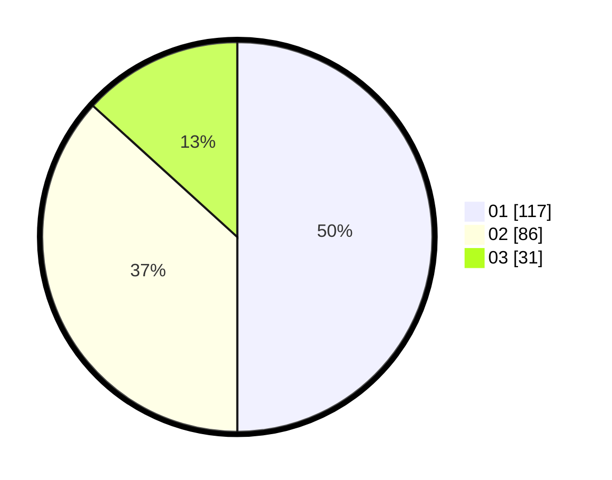

# Hasil

Hasil perolehan suara paslon dapat dilihat pada file paslon-01.txt, paslon-02.txt, dan paslon-03.txt.

Jika tidak ada, artinya data tersebut belum ada pada SIREKAP.

## Perolehan Suara

 * Paslon 01: **117**.
 * Paslon 02: **86**.
 * Paslon 03: **31**.

## Foto C Plano

https://sirekap-obj-formc.kpu.go.id/d228/pemilu/ppwp/31/74/08/10/02/3174081002001-20240216-142726--ab24c313-7818-4994-ac84-0fe2c4a3b13c.jpg

https://sirekap-obj-formc.kpu.go.id/d228/pemilu/ppwp/31/74/08/10/02/3174081002001-20240216-143136--de44d979-04ff-4f91-89a8-3d9c13c4cea4.jpg

https://sirekap-obj-formc.kpu.go.id/d228/pemilu/ppwp/31/74/08/10/02/3174081002001-20240216-143013--9a87135c-8e10-48a6-8148-ea2d3c8649e8.jpg

## DATA PEMILIH TETAP

Jumlah pemilih dalam DPT: **273**.
 * L: **128**.
 * P: **145**.

## DATA PENGGUNA HAK PILIH

Jumlah pengguna hak pilih dalam DPT: **234**.
 * L: **112**.
 * P: **122**.

Jumlah pengguna hak pilih dalam DPTb: **5**.
 * L: **3**.
 * P: **2**.

Jumlah pengguna hak pilih dalam DPK: **0**.
 * L: **0**.
 * P: **0**.

Jumlah pengguna hak pilih: **239**.
 * L: **115**.
 * P: **124**.

## JUMLAH SUARA SAH DAN TIDAK SAH

JUMLAH SELURUH SUARA SAH: **234**.

JUMLAH SUARA TIDAK SAH: **5**.

JUMLAH SELURUH SUARA SAH DAN SUARA TIDAK SAH: **239**.
