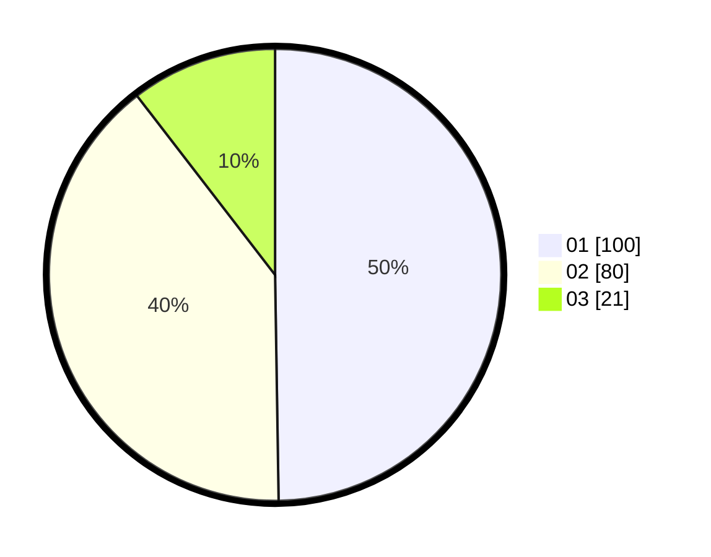

# Hasil

Hasil perolehan suara paslon dapat dilihat pada file paslon-01.txt, paslon-02.txt, dan paslon-03.txt.

Jika tidak ada, artinya data tersebut belum ada pada SIREKAP.

## Perolehan Suara

 * Paslon 01: **100**.
 * Paslon 02: **80**.
 * Paslon 03: **21**.

## Foto C Plano

https://sirekap-obj-formc.kpu.go.id/ce85/pemilu/ppwp/31/74/08/10/02/3174081002005-20240217-114931--fa5ef699-52e8-412c-baa3-d0f1a12d6ae0.jpg

https://sirekap-obj-formc.kpu.go.id/ce85/pemilu/ppwp/31/74/08/10/02/3174081002005-20240217-114957--0bf1caeb-3be9-40f1-a563-79da9fc88fc8.jpg

https://sirekap-obj-formc.kpu.go.id/ce85/pemilu/ppwp/31/74/08/10/02/3174081002005-20240217-115124--07400f78-0f52-4a09-8413-36ae302cb3af.jpg

## DATA PEMILIH TETAP

Jumlah pemilih dalam DPT: **202**.
 * L: **101**.
 * P: **101**.

## DATA PENGGUNA HAK PILIH

Jumlah pengguna hak pilih dalam DPT: **202**.
 * L: **101**.
 * P: **101**.

Jumlah pengguna hak pilih dalam DPTb: **2**.
 * L: **5**.
 * P: **1**.

Jumlah pengguna hak pilih dalam DPK: **0**.
 * L: **6**.
 * P: **0**.

Jumlah pengguna hak pilih: **204**.
 * L: **102**.
 * P: **102**.

## JUMLAH SUARA SAH DAN TIDAK SAH

JUMLAH SELURUH SUARA SAH: **201**.

JUMLAH SUARA TIDAK SAH: **3**.

JUMLAH SELURUH SUARA SAH DAN SUARA TIDAK SAH: **204**.
