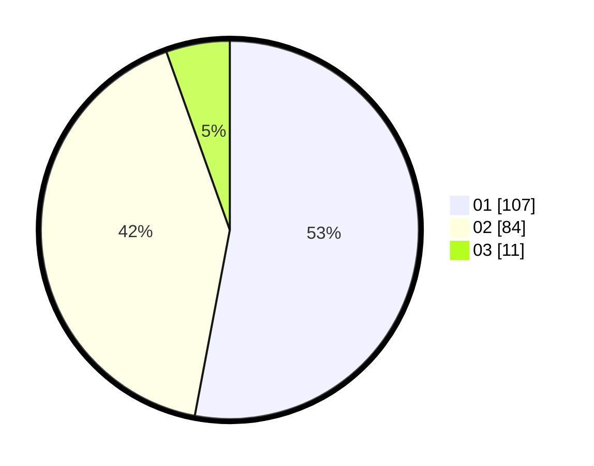

# Hasil

Hasil perolehan suara paslon dapat dilihat pada file paslon-01.txt, paslon-02.txt, dan paslon-03.txt.

Jika tidak ada, artinya data tersebut belum ada pada SIREKAP.

## Perolehan Suara

 * Paslon 01: **107**.
 * Paslon 02: **84**.
 * Paslon 03: **11**.

## Foto C Plano

https://sirekap-obj-formc.kpu.go.id/2893/pemilu/ppwp/31/74/08/10/02/3174081002012-20240214-201128--265343be-3c63-46da-82a8-5f8f7edf20f6.jpg

https://sirekap-obj-formc.kpu.go.id/2893/pemilu/ppwp/31/74/08/10/02/3174081002012-20240214-213429--176c6cfe-4fc8-481d-9d96-3ae0ea1755ab.jpg

https://sirekap-obj-formc.kpu.go.id/2893/pemilu/ppwp/31/74/08/10/02/3174081002012-20240214-213530--cefa6182-20f7-47f0-b50a-f286f244596a.jpg

## DATA PEMILIH TETAP

Jumlah pemilih dalam DPT: **256**.
 * L: **128**.
 * P: **128**.

## DATA PENGGUNA HAK PILIH

Jumlah pengguna hak pilih dalam DPT: **201**.
 * L: **105**.
 * P: **96**.

Jumlah pengguna hak pilih dalam DPTb: **0**.
 * L: **0**.
 * P: **0**.

Jumlah pengguna hak pilih dalam DPK: **2**.
 * L: **1**.
 * P: **1**.

Jumlah pengguna hak pilih: **203**.
 * L: **106**.
 * P: **97**.

## JUMLAH SUARA SAH DAN TIDAK SAH

JUMLAH SELURUH SUARA SAH: **202**.

JUMLAH SUARA TIDAK SAH: **1**.

JUMLAH SELURUH SUARA SAH DAN SUARA TIDAK SAH: **203**.
