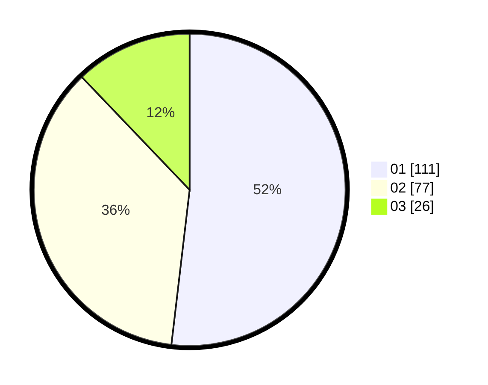

# Hasil

Hasil perolehan suara paslon dapat dilihat pada file paslon-01.txt, paslon-02.txt, dan paslon-03.txt.

Jika tidak ada, artinya data tersebut belum ada pada SIREKAP.

## Perolehan Suara

 * Paslon 01: **111**.
 * Paslon 02: **77**.
 * Paslon 03: **26**.

## Foto C Plano

https://sirekap-obj-formc.kpu.go.id/0943/pemilu/ppwp/31/74/08/10/02/3174081002014-20240214-155705--d058f12c-7c1d-42e3-8d07-311afe7b2f83.jpg

https://sirekap-obj-formc.kpu.go.id/0943/pemilu/ppwp/31/74/08/10/02/3174081002014-20240214-155701--6152b6b7-5e06-471a-94ad-c81600ce92df.jpg

https://sirekap-obj-formc.kpu.go.id/0943/pemilu/ppwp/31/74/08/10/02/3174081002014-20240214-155636--69b0bb98-078c-42c5-a235-f1535a1f4846.jpg

## DATA PEMILIH TETAP

Jumlah pemilih dalam DPT: **281**.
 * L: **140**.
 * P: **141**.

## DATA PENGGUNA HAK PILIH

Jumlah pengguna hak pilih dalam DPT: **209**.
 * L: **102**.
 * P: **107**.

Jumlah pengguna hak pilih dalam DPTb: **5**.
 * L: **2**.
 * P: **3**.

Jumlah pengguna hak pilih dalam DPK: **3**.
 * L: **2**.
 * P: **1**.

Jumlah pengguna hak pilih: **217**.
 * L: **106**.
 * P: **111**.

## JUMLAH SUARA SAH DAN TIDAK SAH

JUMLAH SELURUH SUARA SAH: **214**.

JUMLAH SUARA TIDAK SAH: **3**.

JUMLAH SELURUH SUARA SAH DAN SUARA TIDAK SAH: **217**.
