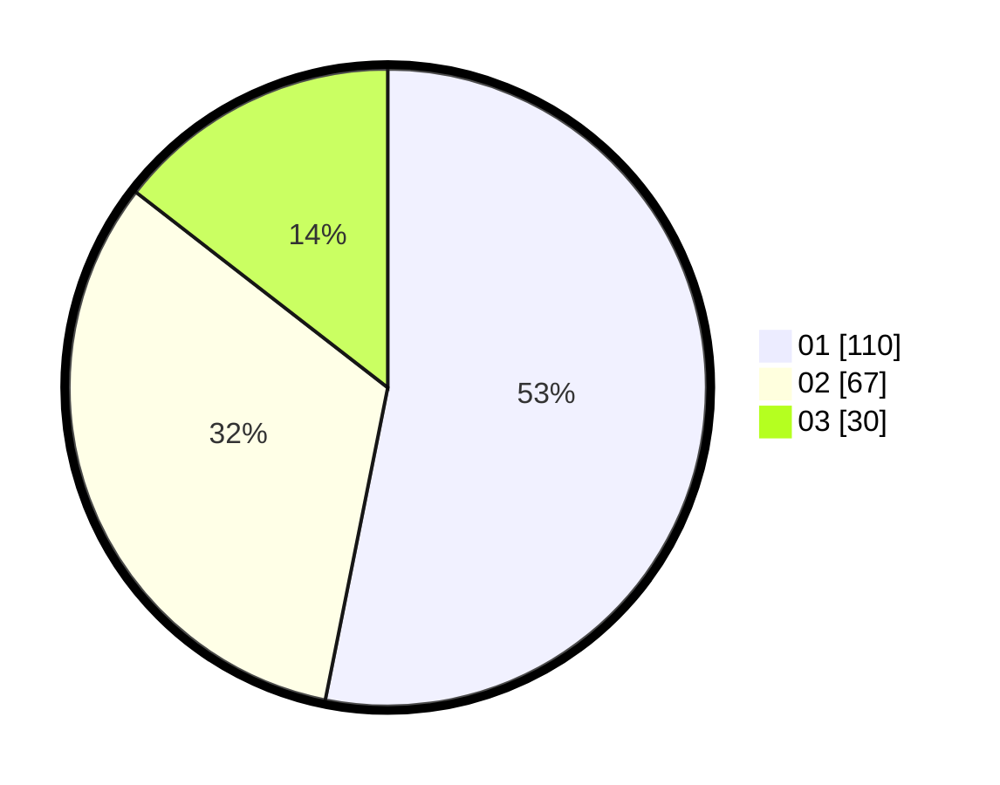

# Hasil

Hasil perolehan suara paslon dapat dilihat pada file paslon-01.txt, paslon-02.txt, dan paslon-03.txt.

Jika tidak ada, artinya data tersebut belum ada pada SIREKAP.

## Perolehan Suara

 * Paslon 01: **110**.
 * Paslon 02: **67**.
 * Paslon 03: **30**.

## Foto C Plano

https://sirekap-obj-formc.kpu.go.id/0f45/pemilu/ppwp/31/74/08/10/02/3174081002023-20240214-194757--26e4c3a6-7f2c-44f4-8c30-8786dacaf718.jpg

https://sirekap-obj-formc.kpu.go.id/0f45/pemilu/ppwp/31/74/08/10/02/3174081002023-20240214-194804--8fd0bbd0-0e58-4eb2-bc37-ba2f8710c67f.jpg

https://sirekap-obj-formc.kpu.go.id/0f45/pemilu/ppwp/31/74/08/10/02/3174081002023-20240214-225934--998096fb-fffa-4588-9c22-562744cf9b1d.jpg
