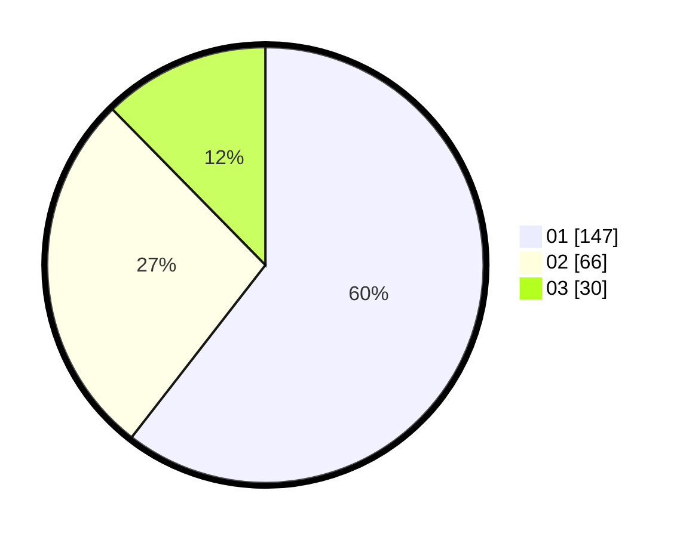

# Hasil

Hasil perolehan suara paslon dapat dilihat pada file paslon-01.txt, paslon-02.txt, dan paslon-03.txt.

Jika tidak ada, artinya data tersebut belum ada pada SIREKAP.

## Perolehan Suara

 * Paslon 01: **147**.
 * Paslon 02: **66**.
 * Paslon 03: **30**.

## Foto C Plano

https://sirekap-obj-formc.kpu.go.id/8831/pemilu/ppwp/31/74/08/10/02/3174081002030-20240214-194949--58241908-8213-40e5-a4d1-d0847513736d.jpg

https://sirekap-obj-formc.kpu.go.id/8831/pemilu/ppwp/31/74/08/10/02/3174081002030-20240214-192545--caf78e9d-bb5a-41e7-be55-7fda56f5220d.jpg

https://sirekap-obj-formc.kpu.go.id/8831/pemilu/ppwp/31/74/08/10/02/3174081002030-20240214-193046--b4556b7f-b842-4d64-b89f-0b27a95f81ca.jpg

## DATA PEMILIH TETAP

Jumlah pemilih dalam DPT: **283**.
 * L: **128**.
 * P: **155**.

## DATA PENGGUNA HAK PILIH

Jumlah pengguna hak pilih dalam DPT: **227**.
 * L: **104**.
 * P: **123**.

Jumlah pengguna hak pilih dalam DPTb: **16**.
 * L: **13**.
 * P: **3**.

Jumlah pengguna hak pilih dalam DPK: **0**.
 * L: **0**.
 * P: **0**.

Jumlah pengguna hak pilih: **243**.
 * L: **117**.
 * P: **126**.

## JUMLAH SUARA SAH DAN TIDAK SAH

JUMLAH SELURUH SUARA SAH: **243**.

JUMLAH SUARA TIDAK SAH: **0**.

JUMLAH SELURUH SUARA SAH DAN SUARA TIDAK SAH: **243**.
