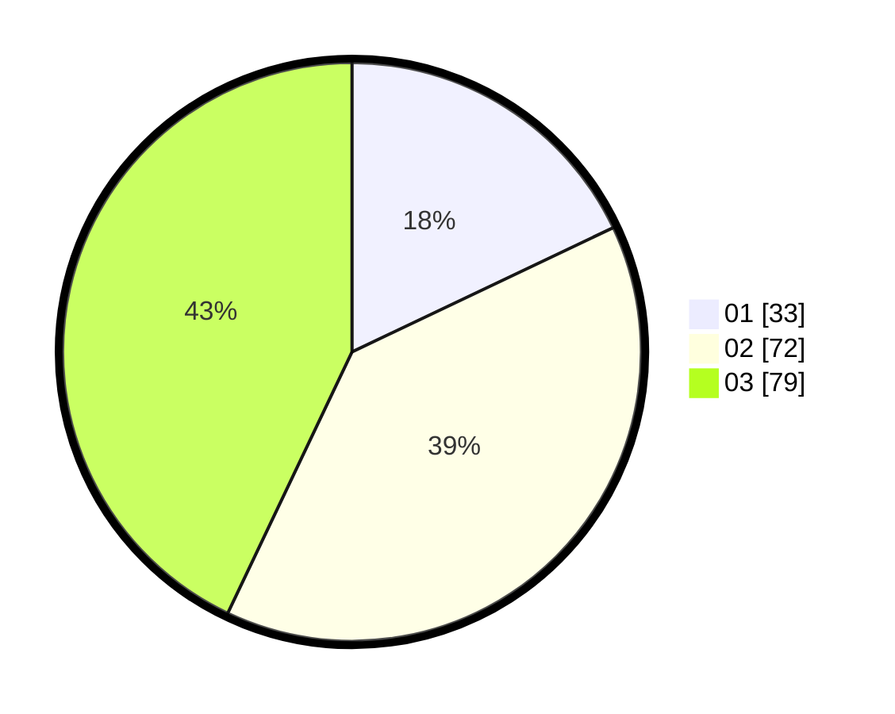

# Hasil

Hasil perolehan suara paslon dapat dilihat pada file paslon-01.txt, paslon-02.txt, dan paslon-03.txt.

Jika tidak ada, artinya data tersebut belum ada pada SIREKAP.

## Perolehan Suara

 * Paslon 01: **33**.
 * Paslon 02: **72**.
 * Paslon 03: **79**.

## Foto C Plano

https://sirekap-obj-formc.kpu.go.id/9dc5/pemilu/ppwp/31/74/08/10/02/3174081002034-20240216-153424--cb4c71dc-0a91-443a-9f6e-d45584e2cda3.jpg

https://sirekap-obj-formc.kpu.go.id/9dc5/pemilu/ppwp/31/74/08/10/02/3174081002034-20240216-153425--8482c7f4-c4e6-4283-8f73-f81494a55c3e.jpg

https://sirekap-obj-formc.kpu.go.id/9dc5/pemilu/ppwp/31/74/08/10/02/3174081002034-20240216-153425--efcb5aa0-ef10-4d3b-9563-9d981e27fb27.jpg

## DATA PEMILIH TETAP

Jumlah pemilih dalam DPT: **244**.
 * L: **114**.
 * P: **130**.

## DATA PENGGUNA HAK PILIH

Jumlah pengguna hak pilih dalam DPT: **183**.
 * L: **86**.
 * P: **97**.

Jumlah pengguna hak pilih dalam DPTb: **5**.
 * L: **3**.
 * P: **2**.

Jumlah pengguna hak pilih dalam DPK: **0**.
 * L: **0**.
 * P: **0**.

Jumlah pengguna hak pilih: **188**.
 * L: **89**.
 * P: **99**.

## JUMLAH SUARA SAH DAN TIDAK SAH

JUMLAH SELURUH SUARA SAH: **184**.

JUMLAH SUARA TIDAK SAH: **4**.

JUMLAH SELURUH SUARA SAH DAN SUARA TIDAK SAH: **188**.
