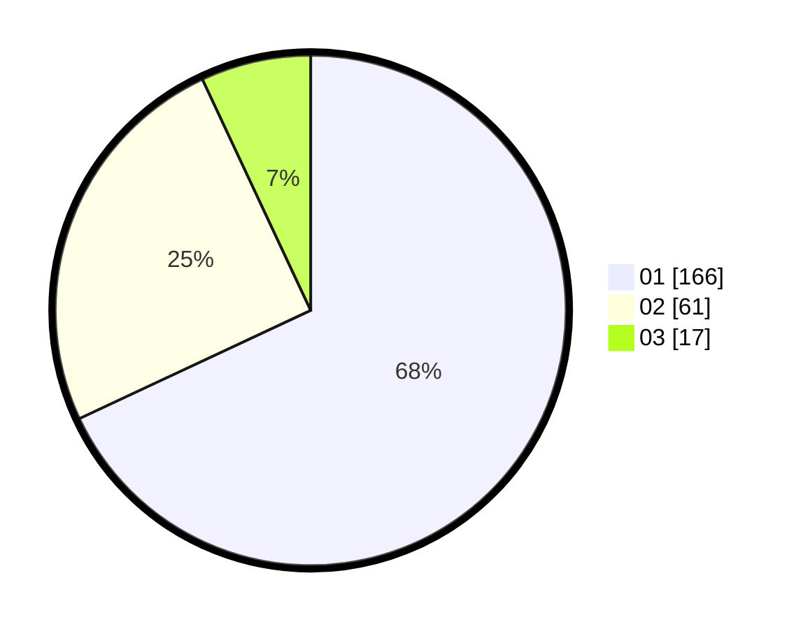

# Hasil

Hasil perolehan suara paslon dapat dilihat pada file paslon-01.txt, paslon-02.txt, dan paslon-03.txt.

Jika tidak ada, artinya data tersebut belum ada pada SIREKAP.

## Perolehan Suara

 * Paslon 01: **166**.
 * Paslon 02: **61**.
 * Paslon 03: **17**.

## Foto C Plano

https://sirekap-obj-formc.kpu.go.id/185e/pemilu/ppwp/31/74/08/10/02/3174081002041-20240215-015305--07e2300c-9ebf-4c3f-8027-2c59228e67b5.jpg

https://sirekap-obj-formc.kpu.go.id/185e/pemilu/ppwp/31/74/08/10/02/3174081002041-20240215-015358--1c9f1205-e220-4f90-943f-af2e20fa218d.jpg

https://sirekap-obj-formc.kpu.go.id/185e/pemilu/ppwp/31/74/08/10/02/3174081002041-20240215-015505--f4872a40-2a04-4882-83f1-708df883764d.jpg

## DATA PEMILIH TETAP

Jumlah pemilih dalam DPT: **265**.
 * L: **124**.
 * P: **141**.

## DATA PENGGUNA HAK PILIH

Jumlah pengguna hak pilih dalam DPT: **221**.
 * L: **104**.
 * P: **117**.

Jumlah pengguna hak pilih dalam DPTb: **23**.
 * L: **10**.
 * P: **13**.

Jumlah pengguna hak pilih dalam DPK: **1**.
 * L: **1**.
 * P: **0**.

Jumlah pengguna hak pilih: **245**.
 * L: **115**.
 * P: **130**.

## JUMLAH SUARA SAH DAN TIDAK SAH

JUMLAH SELURUH SUARA SAH: **244**.

JUMLAH SUARA TIDAK SAH: **2**.

JUMLAH SELURUH SUARA SAH DAN SUARA TIDAK SAH: **246**.
