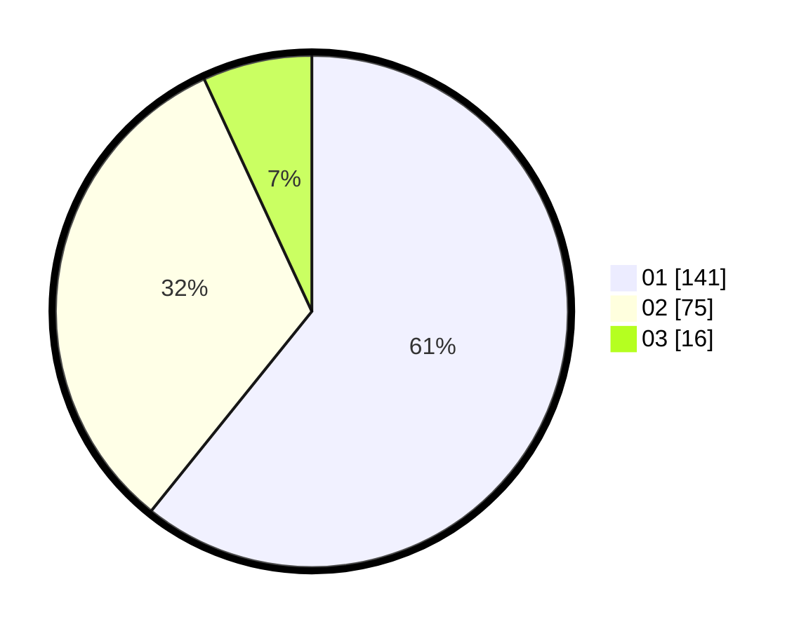

# Hasil

Hasil perolehan suara paslon dapat dilihat pada file paslon-01.txt, paslon-02.txt, dan paslon-03.txt.

Jika tidak ada, artinya data tersebut belum ada pada SIREKAP.

## Perolehan Suara

 * Paslon 01: **141**.
 * Paslon 02: **75**.
 * Paslon 03: **16**.

## Foto C Plano

https://sirekap-obj-formc.kpu.go.id/ef42/pemilu/ppwp/31/74/08/10/02/3174081002056-20240214-192307--85432dc2-9f55-44a0-9538-d6ce8ce84ead.jpg

https://sirekap-obj-formc.kpu.go.id/ef42/pemilu/ppwp/31/74/08/10/02/3174081002056-20240214-193818--36ac8cc8-bfbe-4581-89ed-ce1bd00f83b1.jpg

https://sirekap-obj-formc.kpu.go.id/ef42/pemilu/ppwp/31/74/08/10/02/3174081002056-20240214-194044--bdb852b0-e289-44a2-a43c-c94233a3eab7.jpg

## DATA PEMILIH TETAP

Jumlah pemilih dalam DPT: **290**.
 * L: **151**.
 * P: **139**.

## DATA PENGGUNA HAK PILIH

Jumlah pengguna hak pilih dalam DPT: **235**.
 * L: **117**.
 * P: **118**.

Jumlah pengguna hak pilih dalam DPTb: **0**.
 * L: **0**.
 * P: **0**.

Jumlah pengguna hak pilih dalam DPK: **3**.
 * L: **1**.
 * P: **2**.

Jumlah pengguna hak pilih: **238**.
 * L: **118**.
 * P: **120**.

## JUMLAH SUARA SAH DAN TIDAK SAH

JUMLAH SELURUH SUARA SAH: **232**.

JUMLAH SUARA TIDAK SAH: **6**.

JUMLAH SELURUH SUARA SAH DAN SUARA TIDAK SAH: **238**.
