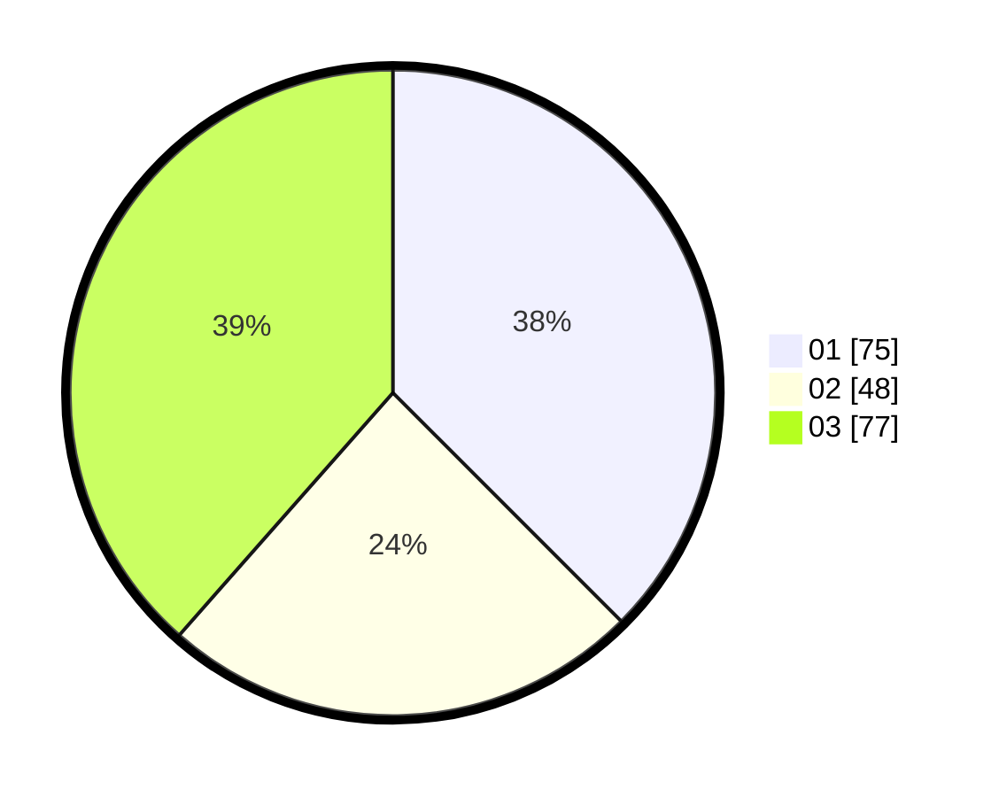

# Hasil

Hasil perolehan suara paslon dapat dilihat pada file paslon-01.txt, paslon-02.txt, dan paslon-03.txt.

Jika tidak ada, artinya data tersebut belum ada pada SIREKAP.

## Perolehan Suara

 * Paslon 01: **75**.
 * Paslon 02: **48**.
 * Paslon 03: **77**.

## Foto C Plano

https://sirekap-obj-formc.kpu.go.id/7038/pemilu/ppwp/31/74/08/10/02/3174081002059-20240214-204319--8d4407b3-ebcc-4f97-8f63-83bff43f8cb6.jpg

https://sirekap-obj-formc.kpu.go.id/7038/pemilu/ppwp/31/74/08/10/02/3174081002059-20240214-204557--034d695b-e6d5-4904-897b-033a0e23315d.jpg

https://sirekap-obj-formc.kpu.go.id/7038/pemilu/ppwp/31/74/08/10/02/3174081002059-20240215-223808--e70f7668-a3e3-4be3-932f-67e5679df958.jpg

## DATA PEMILIH TETAP

Jumlah pemilih dalam DPT: **230**.
 * L: **102**.
 * P: **128**.

## DATA PENGGUNA HAK PILIH

Jumlah pengguna hak pilih dalam DPT: **196**.
 * L: **85**.
 * P: **111**.

Jumlah pengguna hak pilih dalam DPTb: **3**.
 * L: **1**.
 * P: **2**.

Jumlah pengguna hak pilih dalam DPK: **5**.
 * L: **2**.
 * P: **3**.

Jumlah pengguna hak pilih: **204**.
 * L: **88**.
 * P: **116**.

## JUMLAH SUARA SAH DAN TIDAK SAH

JUMLAH SELURUH SUARA SAH: **200**.

JUMLAH SUARA TIDAK SAH: **4**.

JUMLAH SELURUH SUARA SAH DAN SUARA TIDAK SAH: **204**.
