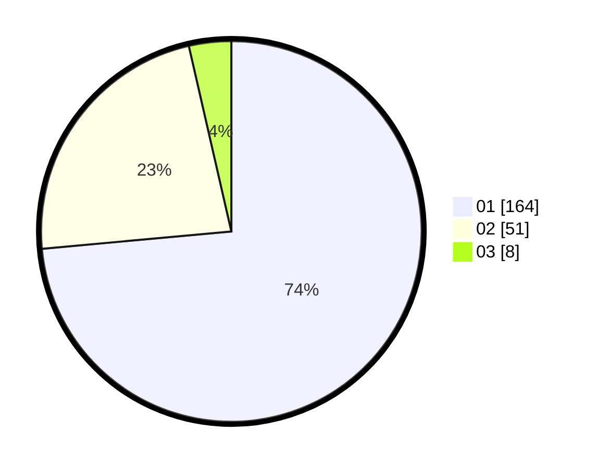

# Hasil

Hasil perolehan suara paslon dapat dilihat pada file paslon-01.txt, paslon-02.txt, dan paslon-03.txt.

Jika tidak ada, artinya data tersebut belum ada pada SIREKAP.

## Perolehan Suara

 * Paslon 01: **164**.
 * Paslon 02: **51**.
 * Paslon 03: **8**.

## Foto C Plano

https://sirekap-obj-formc.kpu.go.id/6a65/pemilu/ppwp/31/74/08/10/02/3174081002061-20240214-185717--9672cfb1-b05d-4abd-856a-09f099613e78.jpg

https://sirekap-obj-formc.kpu.go.id/6a65/pemilu/ppwp/31/74/08/10/02/3174081002061-20240214-184643--ad7df628-dcef-441d-b8c3-4069e08d23c2.jpg

https://sirekap-obj-formc.kpu.go.id/6a65/pemilu/ppwp/31/74/08/10/02/3174081002061-20240214-190217--a7cc9eee-fed9-4a92-9094-f40b813bdb12.jpg

## DATA PEMILIH TETAP

Jumlah pemilih dalam DPT: **264**.
 * L: **132**.
 * P: **132**.

## DATA PENGGUNA HAK PILIH

Jumlah pengguna hak pilih dalam DPT: **219**.
 * L: **110**.
 * P: **109**.

Jumlah pengguna hak pilih dalam DPTb: **6**.
 * L: **5**.
 * P: **1**.

Jumlah pengguna hak pilih dalam DPK: **4**.
 * L: **2**.
 * P: **2**.

Jumlah pengguna hak pilih: **229**.
 * L: **117**.
 * P: **112**.

## JUMLAH SUARA SAH DAN TIDAK SAH

JUMLAH SELURUH SUARA SAH: **223**.

JUMLAH SUARA TIDAK SAH: **6**.

JUMLAH SELURUH SUARA SAH DAN SUARA TIDAK SAH: **229**.
