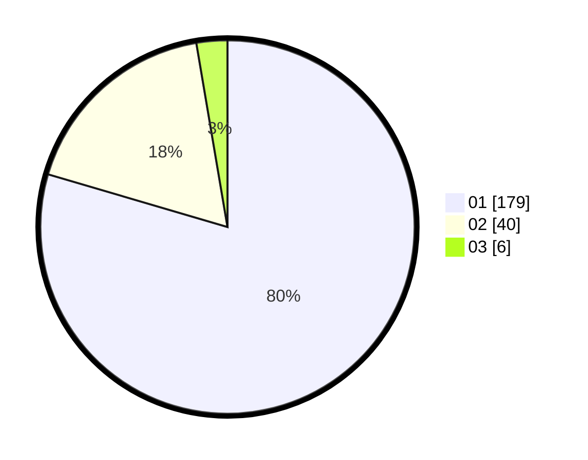

# Hasil

Hasil perolehan suara paslon dapat dilihat pada file paslon-01.txt, paslon-02.txt, dan paslon-03.txt.

Jika tidak ada, artinya data tersebut belum ada pada SIREKAP.

## Perolehan Suara

 * Paslon 01: **179**.
 * Paslon 02: **40**.
 * Paslon 03: **6**.

## Foto C Plano

https://sirekap-obj-formc.kpu.go.id/bb0f/pemilu/ppwp/31/74/08/10/02/3174081002066-20240214-195135--2011bcc8-cde2-4165-8602-86df175bc144.jpg

https://sirekap-obj-formc.kpu.go.id/bb0f/pemilu/ppwp/31/74/08/10/02/3174081002066-20240214-155234--1b1a744e-4e63-4e44-aee2-d943af1b02fe.jpg

https://sirekap-obj-formc.kpu.go.id/bb0f/pemilu/ppwp/31/74/08/10/02/3174081002066-20240214-155241--f784b33a-ff79-4c8e-9994-6e6f944531ad.jpg

## DATA PEMILIH TETAP

Jumlah pemilih dalam DPT: **242**.
 * L: **121**.
 * P: **121**.

## DATA PENGGUNA HAK PILIH

Jumlah pengguna hak pilih dalam DPT: **208**.
 * L: **103**.
 * P: **105**.

Jumlah pengguna hak pilih dalam DPTb: **6**.
 * L: **4**.
 * P: **2**.

Jumlah pengguna hak pilih dalam DPK: **12**.
 * L: **6**.
 * P: **6**.

Jumlah pengguna hak pilih: **226**.
 * L: **113**.
 * P: **113**.

## JUMLAH SUARA SAH DAN TIDAK SAH

JUMLAH SELURUH SUARA SAH: **225**.

JUMLAH SUARA TIDAK SAH: **1**.

JUMLAH SELURUH SUARA SAH DAN SUARA TIDAK SAH: **226**.
