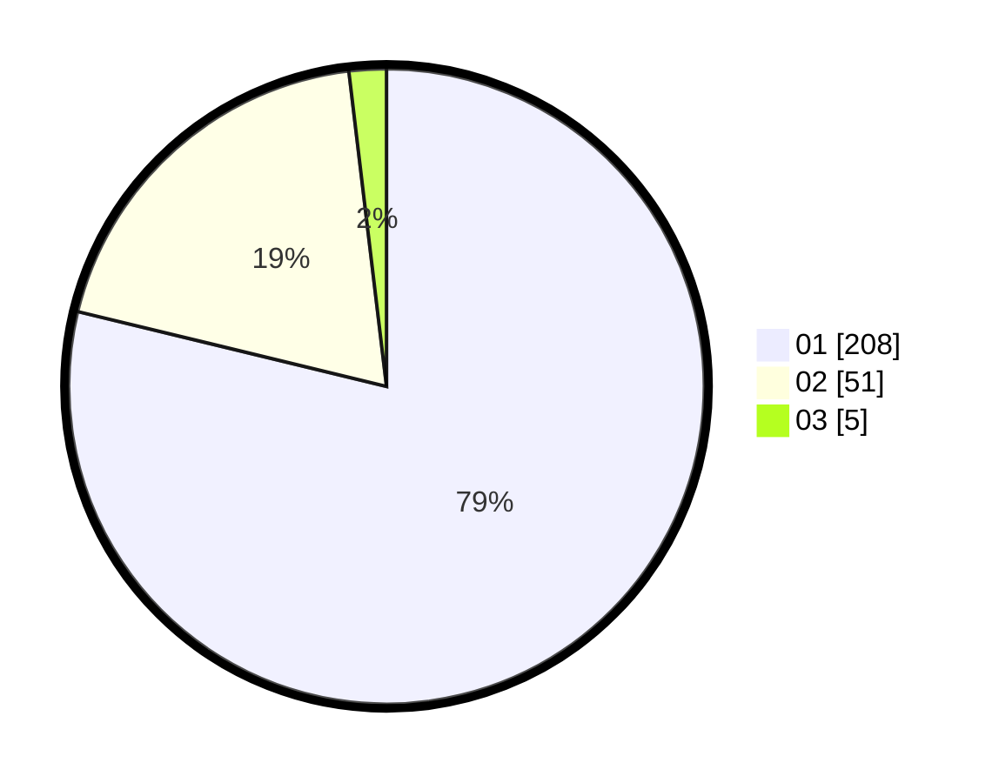

# Hasil

Hasil perolehan suara paslon dapat dilihat pada file paslon-01.txt, paslon-02.txt, dan paslon-03.txt.

Jika tidak ada, artinya data tersebut belum ada pada SIREKAP.

## Perolehan Suara

 * Paslon 01: **208**.
 * Paslon 02: **51**.
 * Paslon 03: **5**.

## Foto C Plano

https://sirekap-obj-formc.kpu.go.id/0753/pemilu/ppwp/31/74/08/10/02/3174081002067-20240218-171038--f03d0c7f-4625-427a-97e5-9fa5ef33f08d.jpg

https://sirekap-obj-formc.kpu.go.id/0753/pemilu/ppwp/31/74/08/10/02/3174081002067-20240214-224758--35aed480-fa61-44b4-8c34-820eb4aa54f6.jpg

https://sirekap-obj-formc.kpu.go.id/0753/pemilu/ppwp/31/74/08/10/02/3174081002067-20240214-225009--3e392fbf-53f7-4016-8b89-eee15dbe101b.jpg

## DATA PEMILIH TETAP

Jumlah pemilih dalam DPT: **278**.
 * L: **130**.
 * P: **148**.

## DATA PENGGUNA HAK PILIH

Jumlah pengguna hak pilih dalam DPT: **250**.
 * L: **120**.
 * P: **130**.

Jumlah pengguna hak pilih dalam DPTb: **13**.
 * L: **10**.
 * P: **3**.

Jumlah pengguna hak pilih dalam DPK: **2**.
 * L: **0**.
 * P: **2**.

Jumlah pengguna hak pilih: **265**.
 * L: **130**.
 * P: **135**.

## JUMLAH SUARA SAH DAN TIDAK SAH

JUMLAH SELURUH SUARA SAH: **264**.

JUMLAH SUARA TIDAK SAH: **1**.

JUMLAH SELURUH SUARA SAH DAN SUARA TIDAK SAH: **265**.
