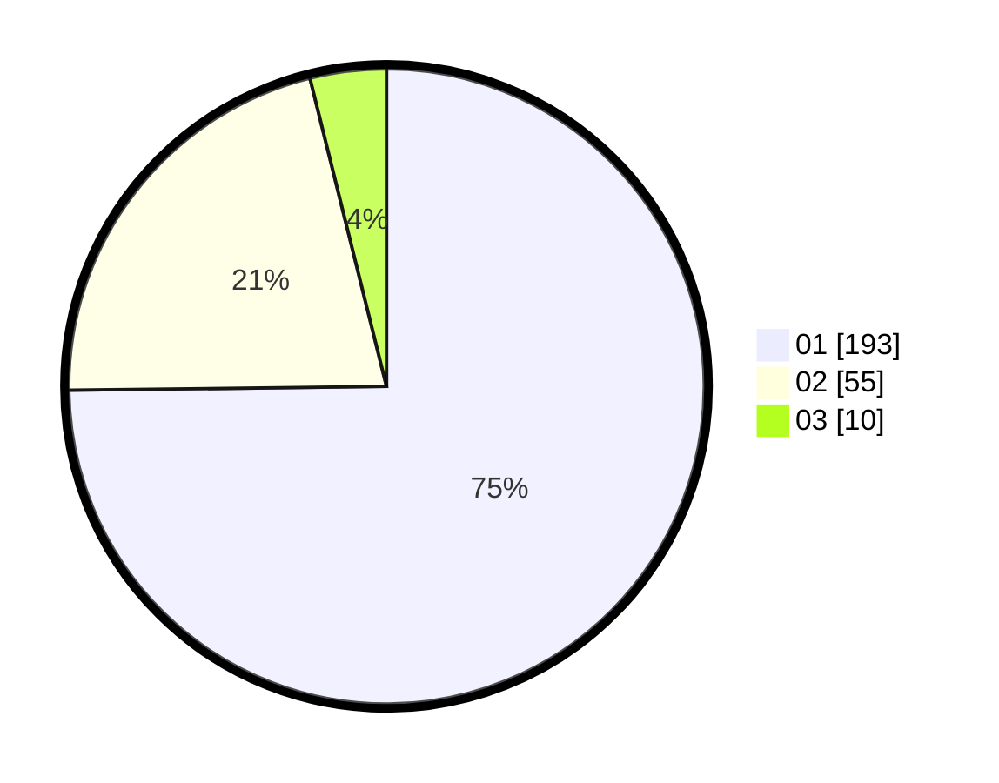

# Hasil

Hasil perolehan suara paslon dapat dilihat pada file paslon-01.txt, paslon-02.txt, dan paslon-03.txt.

Jika tidak ada, artinya data tersebut belum ada pada SIREKAP.

## Perolehan Suara

 * Paslon 01: **193**.
 * Paslon 02: **55**.
 * Paslon 03: **10**.

## Foto C Plano

https://sirekap-obj-formc.kpu.go.id/db76/pemilu/ppwp/31/74/08/10/02/3174081002072-20240219-124204--6bc73974-3e3c-41ce-a7eb-c0954c25d169.jpg

https://sirekap-obj-formc.kpu.go.id/db76/pemilu/ppwp/31/74/08/10/02/3174081002072-20240219-105559--42f12125-aafa-48c3-a99a-2a49cb9040eb.jpg

https://sirekap-obj-formc.kpu.go.id/db76/pemilu/ppwp/31/74/08/10/02/3174081002072-20240219-110653--51e56a98-c930-4b39-afee-e515081746fc.jpg

## DATA PEMILIH TETAP

Jumlah pemilih dalam DPT: **295**.
 * L: **148**.
 * P: **147**.

## DATA PENGGUNA HAK PILIH

Jumlah pengguna hak pilih dalam DPT: **253**.
 * L: **123**.
 * P: **130**.

Jumlah pengguna hak pilih dalam DPTb: **5**.
 * L: **5**.
 * P: **0**.

Jumlah pengguna hak pilih dalam DPK: **1**.
 * L: **0**.
 * P: **1**.

Jumlah pengguna hak pilih: **259**.
 * L: **128**.
 * P: **131**.

## JUMLAH SUARA SAH DAN TIDAK SAH

JUMLAH SELURUH SUARA SAH: **258**.

JUMLAH SUARA TIDAK SAH: **1**.

JUMLAH SELURUH SUARA SAH DAN SUARA TIDAK SAH: **259**.
