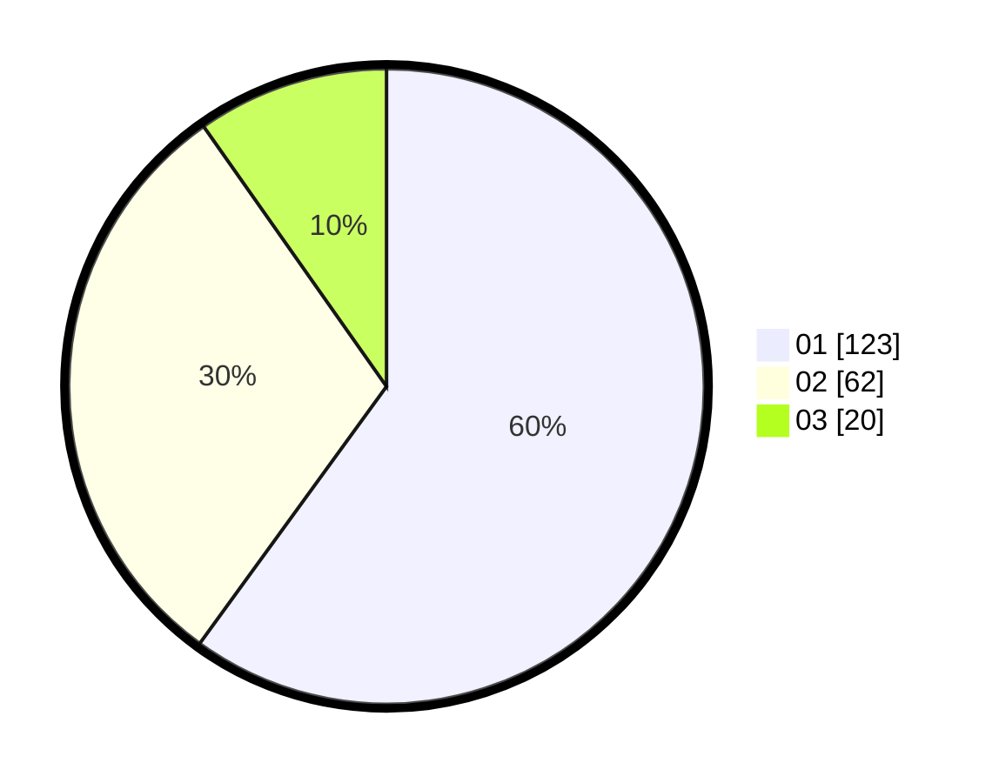

# Hasil

Hasil perolehan suara paslon dapat dilihat pada file paslon-01.txt, paslon-02.txt, dan paslon-03.txt.

Jika tidak ada, artinya data tersebut belum ada pada SIREKAP.

## Perolehan Suara

 * Paslon 01: **123**.
 * Paslon 02: **62**.
 * Paslon 03: **20**.

## Foto C Plano

https://sirekap-obj-formc.kpu.go.id/cff4/pemilu/ppwp/31/74/08/10/02/3174081002083-20240215-020437--1d105b4e-4153-45e1-9145-a440ae9f0847.jpg

https://sirekap-obj-formc.kpu.go.id/cff4/pemilu/ppwp/31/74/08/10/02/3174081002083-20240215-020533--5bd72116-917e-4266-b3a6-23b0127168b5.jpg

https://sirekap-obj-formc.kpu.go.id/cff4/pemilu/ppwp/31/74/08/10/02/3174081002083-20240215-020600--d7388ae4-1509-44af-9b3a-2b431bcea16a.jpg

## DATA PEMILIH TETAP

Jumlah pemilih dalam DPT: **264**.
 * L: **136**.
 * P: **128**.

## DATA PENGGUNA HAK PILIH

Jumlah pengguna hak pilih dalam DPT: **204**.
 * L: **102**.
 * P: **102**.

Jumlah pengguna hak pilih dalam DPTb: **2**.
 * L: **0**.
 * P: **2**.

Jumlah pengguna hak pilih dalam DPK: **0**.
 * L: **0**.
 * P: **0**.

Jumlah pengguna hak pilih: **206**.
 * L: **102**.
 * P: **104**.

## JUMLAH SUARA SAH DAN TIDAK SAH

JUMLAH SELURUH SUARA SAH: **205**.

JUMLAH SUARA TIDAK SAH: **1**.

JUMLAH SELURUH SUARA SAH DAN SUARA TIDAK SAH: **206**.
