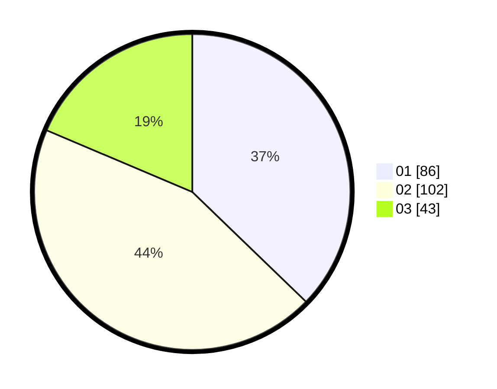

# Hasil

Hasil perolehan suara paslon dapat dilihat pada file paslon-01.txt, paslon-02.txt, dan paslon-03.txt.

Jika tidak ada, artinya data tersebut belum ada pada SIREKAP.

## Perolehan Suara

 * Paslon 01: **86**.
 * Paslon 02: **102**.
 * Paslon 03: **43**.

## Foto C Plano

https://sirekap-obj-formc.kpu.go.id/d3d1/pemilu/ppwp/31/74/08/10/02/3174081002087-20240218-180551--52b86f5f-66cc-4713-9e41-bdb6f325e517.jpg

https://sirekap-obj-formc.kpu.go.id/d3d1/pemilu/ppwp/31/74/08/10/02/3174081002087-20240218-180639--43468128-3629-41b9-b7b3-8fee782991f5.jpg

https://sirekap-obj-formc.kpu.go.id/d3d1/pemilu/ppwp/31/74/08/10/02/3174081002087-20240218-180826--4c19c9ab-0b46-420b-8cb3-c2ab57dd9e63.jpg

## DATA PEMILIH TETAP

Jumlah pemilih dalam DPT: **279**.
 * L: **132**.
 * P: **147**.

## DATA PENGGUNA HAK PILIH

Jumlah pengguna hak pilih dalam DPT: **231**.
 * L: **105**.
 * P: **126**.

Jumlah pengguna hak pilih dalam DPTb: **3**.
 * L: **0**.
 * P: **3**.

Jumlah pengguna hak pilih dalam DPK: **1**.
 * L: **1**.
 * P: **0**.

Jumlah pengguna hak pilih: **235**.
 * L: **106**.
 * P: **129**.

## JUMLAH SUARA SAH DAN TIDAK SAH

JUMLAH SELURUH SUARA SAH: **231**.

JUMLAH SUARA TIDAK SAH: **4**.

JUMLAH SELURUH SUARA SAH DAN SUARA TIDAK SAH: **235**.
