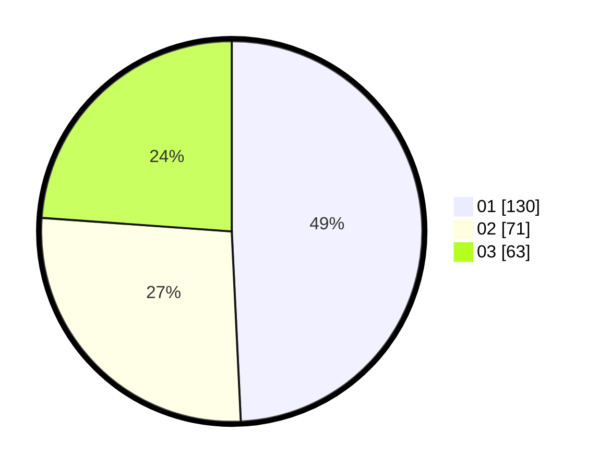

# Hasil

Hasil perolehan suara paslon dapat dilihat pada file paslon-01.txt, paslon-02.txt, dan paslon-03.txt.

Jika tidak ada, artinya data tersebut belum ada pada SIREKAP.

## Perolehan Suara

 * Paslon 01: **130**.
 * Paslon 02: **71**.
 * Paslon 03: **63**.

## Foto C Plano

https://sirekap-obj-formc.kpu.go.id/3189/pemilu/ppwp/31/74/08/10/02/3174081002095-20240214-185047--076ec3e0-ae5f-4065-9578-0951232f7ce8.jpg

https://sirekap-obj-formc.kpu.go.id/3189/pemilu/ppwp/31/74/08/10/02/3174081002095-20240214-184540--03f6b8fa-8d15-4353-aa49-275fee9a6860.jpg

https://sirekap-obj-formc.kpu.go.id/3189/pemilu/ppwp/31/74/08/10/02/3174081002095-20240214-184917--4a38de32-faef-4eb8-8950-f592185fd8dd.jpg

## DATA PEMILIH TETAP

Jumlah pemilih dalam DPT: **295**.
 * L: **145**.
 * P: **149**.

## DATA PENGGUNA HAK PILIH

Jumlah pengguna hak pilih dalam DPT: **259**.
 * L: **125**.
 * P: **134**.

Jumlah pengguna hak pilih dalam DPTb: **1**.
 * L: **0**.
 * P: **1**.

Jumlah pengguna hak pilih dalam DPK: **8**.
 * L: **4**.
 * P: **4**.

Jumlah pengguna hak pilih: **268**.
 * L: **129**.
 * P: **139**.

## JUMLAH SUARA SAH DAN TIDAK SAH

JUMLAH SELURUH SUARA SAH: **264**.

JUMLAH SUARA TIDAK SAH: **4**.

JUMLAH SELURUH SUARA SAH DAN SUARA TIDAK SAH: **268**.
