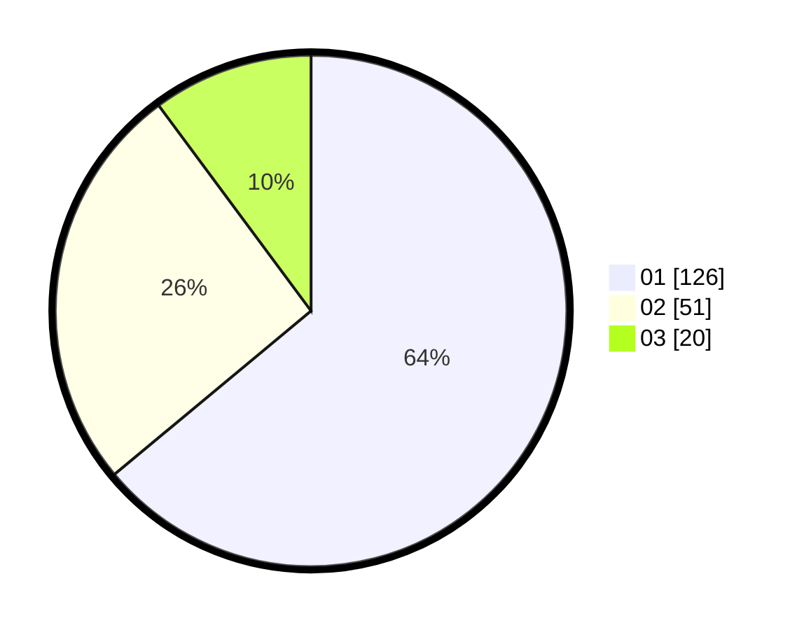

# Hasil

Hasil perolehan suara paslon dapat dilihat pada file paslon-01.txt, paslon-02.txt, dan paslon-03.txt.

Jika tidak ada, artinya data tersebut belum ada pada SIREKAP.

## Perolehan Suara

 * Paslon 01: **126**.
 * Paslon 02: **51**.
 * Paslon 03: **20**.

## Foto C Plano

https://sirekap-obj-formc.kpu.go.id/e2ea/pemilu/ppwp/31/74/08/10/02/3174081002101-20240218-191053--47b60fcc-29c9-4d25-af3f-442cedc4e3c0.jpg

https://sirekap-obj-formc.kpu.go.id/e2ea/pemilu/ppwp/31/74/08/10/02/3174081002101-20240219-120104--2722b505-6af2-433d-b0fb-4de61858006d.jpg

https://sirekap-obj-formc.kpu.go.id/e2ea/pemilu/ppwp/31/74/08/10/02/3174081002101-20240219-120913--66cf81d0-22cc-4d1a-9375-cbfdc55c42fc.jpg

## DATA PEMILIH TETAP

Jumlah pemilih dalam DPT: **233**.
 * L: **124**.
 * P: **109**.

## DATA PENGGUNA HAK PILIH

Jumlah pengguna hak pilih dalam DPT: **188**.
 * L: **100**.
 * P: **88**.

Jumlah pengguna hak pilih dalam DPTb: **7**.
 * L: **3**.
 * P: **4**.

Jumlah pengguna hak pilih dalam DPK: **4**.
 * L: **2**.
 * P: **2**.

Jumlah pengguna hak pilih: **199**.
 * L: **105**.
 * P: **94**.

## JUMLAH SUARA SAH DAN TIDAK SAH

JUMLAH SELURUH SUARA SAH: **197**.

JUMLAH SUARA TIDAK SAH: **2**.

JUMLAH SELURUH SUARA SAH DAN SUARA TIDAK SAH: **199**.
