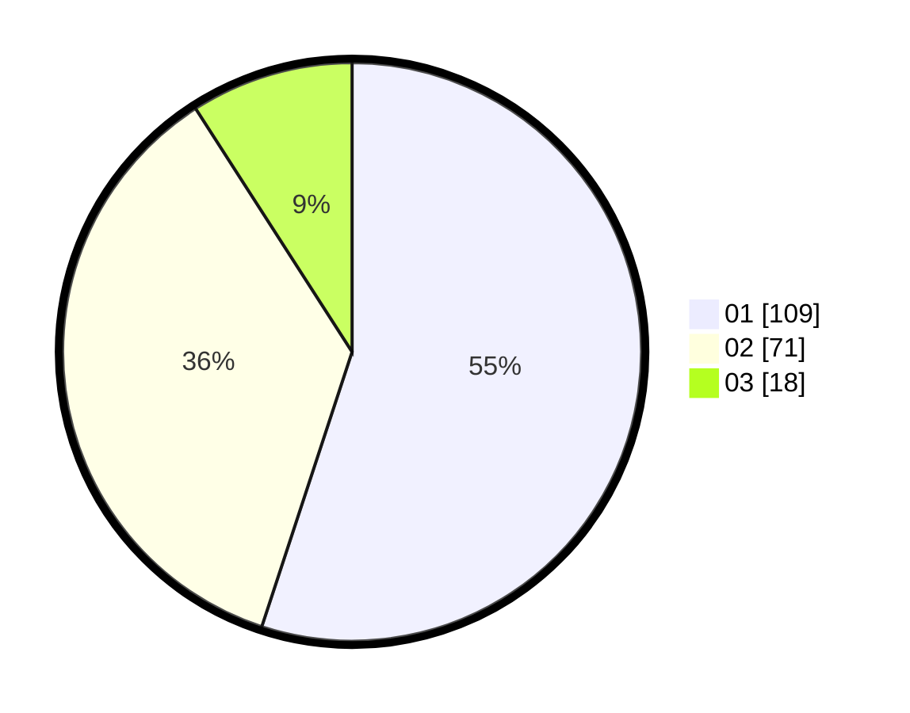

# Hasil

Hasil perolehan suara paslon dapat dilihat pada file paslon-01.txt, paslon-02.txt, dan paslon-03.txt.

Jika tidak ada, artinya data tersebut belum ada pada SIREKAP.

## Perolehan Suara

 * Paslon 01: **109**.
 * Paslon 02: **71**.
 * Paslon 03: **18**.

## Foto C Plano

https://sirekap-obj-formc.kpu.go.id/c14c/pemilu/ppwp/31/74/08/10/02/3174081002102-20240217-173946--7f70e31f-0601-4c93-87af-ff0fda39e604.jpg

https://sirekap-obj-formc.kpu.go.id/c14c/pemilu/ppwp/31/74/08/10/02/3174081002102-20240217-180002--9be33f71-a7e1-4fe6-bc8a-f21be2373647.jpg

https://sirekap-obj-formc.kpu.go.id/c14c/pemilu/ppwp/31/74/08/10/02/3174081002102-20240217-180548--9f84d402-42c9-445c-aa3e-7ff7c1f0ab07.jpg

## DATA PEMILIH TETAP

Jumlah pemilih dalam DPT: **236**.
 * L: **129**.
 * P: **107**.

## DATA PENGGUNA HAK PILIH

Jumlah pengguna hak pilih dalam DPT: **201**.
 * L: **106**.
 * P: **95**.

Jumlah pengguna hak pilih dalam DPTb: **0**.
 * L: **0**.
 * P: **0**.

Jumlah pengguna hak pilih dalam DPK: **0**.
 * L: **0**.
 * P: **0**.

Jumlah pengguna hak pilih: **201**.
 * L: **106**.
 * P: **95**.

## JUMLAH SUARA SAH DAN TIDAK SAH

JUMLAH SELURUH SUARA SAH: **198**.

JUMLAH SUARA TIDAK SAH: **3**.

JUMLAH SELURUH SUARA SAH DAN SUARA TIDAK SAH: **201**.
