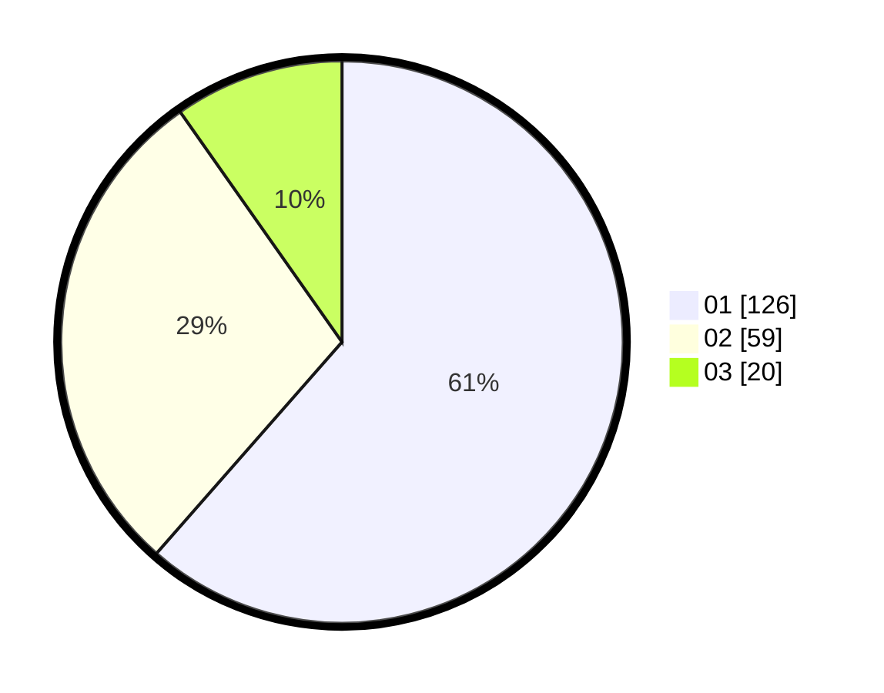

# Hasil

Hasil perolehan suara paslon dapat dilihat pada file paslon-01.txt, paslon-02.txt, dan paslon-03.txt.

Jika tidak ada, artinya data tersebut belum ada pada SIREKAP.

## Perolehan Suara

 * Paslon 01: **126**.
 * Paslon 02: **59**.
 * Paslon 03: **20**.

## Foto C Plano

https://sirekap-obj-formc.kpu.go.id/081a/pemilu/ppwp/31/74/08/10/02/3174081002104-20240219-111412--a6232ba8-5d68-4761-8982-61af864c6eac.jpg

https://sirekap-obj-formc.kpu.go.id/081a/pemilu/ppwp/31/74/08/10/02/3174081002104-20240219-112253--6dde5320-ec1d-4116-81cc-d41193ad72ed.jpg

https://sirekap-obj-formc.kpu.go.id/081a/pemilu/ppwp/31/74/08/10/02/3174081002104-20240219-112827--8b079762-b5cd-44da-9765-610f74b150d6.jpg

## DATA PEMILIH TETAP

Jumlah pemilih dalam DPT: **233**.
 * L: **114**.
 * P: **119**.

## DATA PENGGUNA HAK PILIH

Jumlah pengguna hak pilih dalam DPT: **198**.
 * L: **103**.
 * P: **95**.

Jumlah pengguna hak pilih dalam DPTb: **2**.
 * L: **1**.
 * P: **1**.

Jumlah pengguna hak pilih dalam DPK: **8**.
 * L: **3**.
 * P: **5**.

Jumlah pengguna hak pilih: **208**.
 * L: **107**.
 * P: **101**.

## JUMLAH SUARA SAH DAN TIDAK SAH

JUMLAH SELURUH SUARA SAH: **205**.

JUMLAH SUARA TIDAK SAH: **3**.

JUMLAH SELURUH SUARA SAH DAN SUARA TIDAK SAH: **208**.
