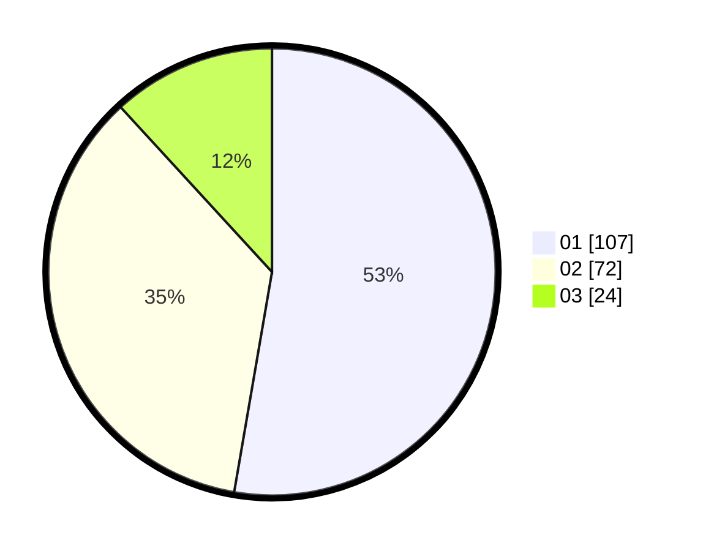

# Hasil

Hasil perolehan suara paslon dapat dilihat pada file paslon-01.txt, paslon-02.txt, dan paslon-03.txt.

Jika tidak ada, artinya data tersebut belum ada pada SIREKAP.

## Perolehan Suara

 * Paslon 01: **107**.
 * Paslon 02: **72**.
 * Paslon 03: **24**.

## Foto C Plano

https://sirekap-obj-formc.kpu.go.id/77cb/pemilu/ppwp/31/74/08/10/02/3174081002109-20240218-123613--9765d781-4afa-404c-b7e2-322b2efdb983.jpg

https://sirekap-obj-formc.kpu.go.id/77cb/pemilu/ppwp/31/74/08/10/02/3174081002109-20240218-132427--8dbc11a4-e6d0-47cf-a9ca-fb02a042bb8c.jpg

https://sirekap-obj-formc.kpu.go.id/77cb/pemilu/ppwp/31/74/08/10/02/3174081002109-20240218-130011--280a260b-7616-4296-8d0d-d44f70fba9f6.jpg

## DATA PEMILIH TETAP

Jumlah pemilih dalam DPT: **273**.
 * L: **135**.
 * P: **138**.

## DATA PENGGUNA HAK PILIH

Jumlah pengguna hak pilih dalam DPT: **200**.
 * L: **95**.
 * P: **105**.

Jumlah pengguna hak pilih dalam DPTb: **6**.
 * L: **6**.
 * P: **0**.

Jumlah pengguna hak pilih dalam DPK: **1**.
 * L: **1**.
 * P: **0**.

Jumlah pengguna hak pilih: **207**.
 * L: **102**.
 * P: **105**.

## JUMLAH SUARA SAH DAN TIDAK SAH

JUMLAH SELURUH SUARA SAH: **203**.

JUMLAH SUARA TIDAK SAH: **4**.

JUMLAH SELURUH SUARA SAH DAN SUARA TIDAK SAH: **207**.
