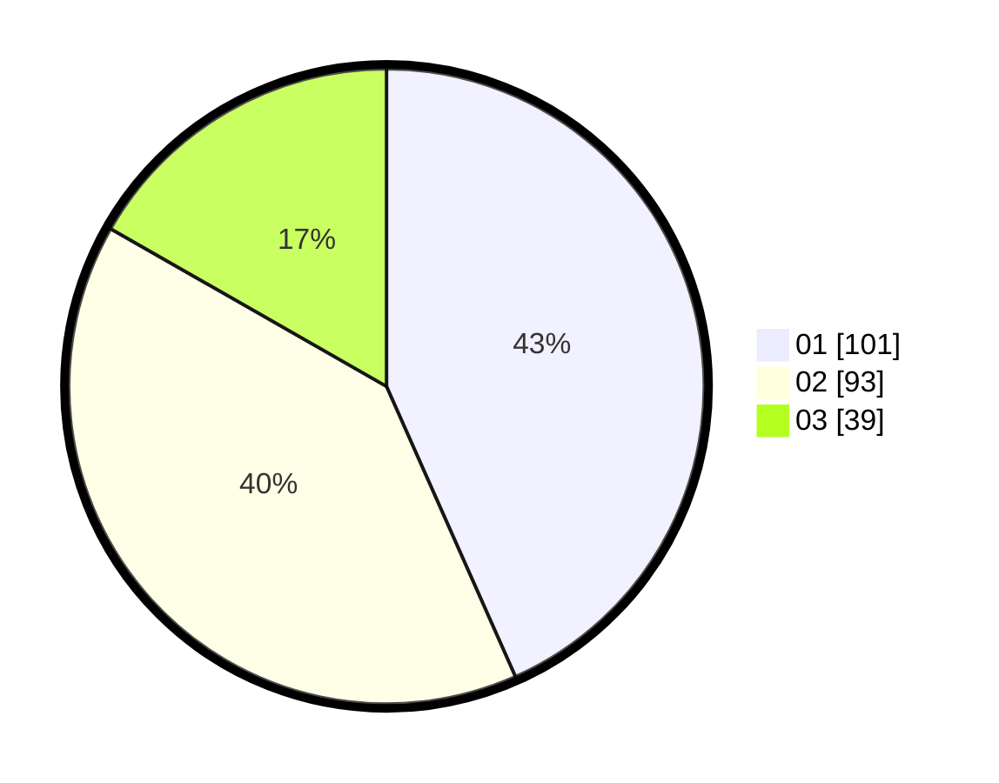

# Hasil

Hasil perolehan suara paslon dapat dilihat pada file paslon-01.txt, paslon-02.txt, dan paslon-03.txt.

Jika tidak ada, artinya data tersebut belum ada pada SIREKAP.

## Perolehan Suara

 * Paslon 01: **101**.
 * Paslon 02: **93**.
 * Paslon 03: **39**.

## Foto C Plano

https://sirekap-obj-formc.kpu.go.id/aeeb/pemilu/ppwp/31/74/08/10/02/3174081002116-20240214-222421--d4291f2b-9776-4fab-b043-cded23c61f9d.jpg

https://sirekap-obj-formc.kpu.go.id/aeeb/pemilu/ppwp/31/74/08/10/02/3174081002116-20240214-223311--5f083ba2-7d90-4bba-b598-293699d916a6.jpg

https://sirekap-obj-formc.kpu.go.id/aeeb/pemilu/ppwp/31/74/08/10/02/3174081002116-20240214-223502--8b8d1db4-e6d1-4861-aa4b-1ef21c57ebe4.jpg

## DATA PEMILIH TETAP

Jumlah pemilih dalam DPT: **270**.
 * L: **131**.
 * P: **139**.

## DATA PENGGUNA HAK PILIH

Jumlah pengguna hak pilih dalam DPT: **229**.
 * L: **117**.
 * P: **112**.

Jumlah pengguna hak pilih dalam DPTb: **1**.
 * L: **1**.
 * P: **0**.

Jumlah pengguna hak pilih dalam DPK: **7**.
 * L: **3**.
 * P: **4**.

Jumlah pengguna hak pilih: **237**.
 * L: **121**.
 * P: **116**.

## JUMLAH SUARA SAH DAN TIDAK SAH

JUMLAH SELURUH SUARA SAH: **233**.

JUMLAH SUARA TIDAK SAH: **4**.

JUMLAH SELURUH SUARA SAH DAN SUARA TIDAK SAH: **237**.
