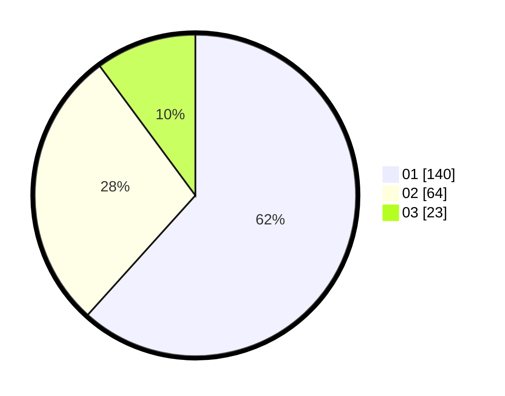

# Hasil

Hasil perolehan suara paslon dapat dilihat pada file paslon-01.txt, paslon-02.txt, dan paslon-03.txt.

Jika tidak ada, artinya data tersebut belum ada pada SIREKAP.

## Perolehan Suara

 * Paslon 01: **140**.
 * Paslon 02: **64**.
 * Paslon 03: **23**.

## Foto C Plano

https://sirekap-obj-formc.kpu.go.id/15c5/pemilu/ppwp/31/74/08/10/02/3174081002117-20240214-155012--9af5d15a-b0ff-48c6-a3f5-e90639b60006.jpg

https://sirekap-obj-formc.kpu.go.id/15c5/pemilu/ppwp/31/74/08/10/02/3174081002117-20240214-155435--01c6de69-90eb-4612-b327-6e33fb1e5893.jpg

https://sirekap-obj-formc.kpu.go.id/15c5/pemilu/ppwp/31/74/08/10/02/3174081002117-20240214-155124--80e5fdb3-3539-4963-a8b1-144cd012ae34.jpg

## DATA PEMILIH TETAP

Jumlah pemilih dalam DPT: **270**.
 * L: **122**.
 * P: **148**.

## DATA PENGGUNA HAK PILIH

Jumlah pengguna hak pilih dalam DPT: **225**.
 * L: **94**.
 * P: **131**.

Jumlah pengguna hak pilih dalam DPTb: **0**.
 * L: **0**.
 * P: **0**.

Jumlah pengguna hak pilih dalam DPK: **5**.
 * L: **2**.
 * P: **3**.

Jumlah pengguna hak pilih: **230**.
 * L: **96**.
 * P: **134**.

## JUMLAH SUARA SAH DAN TIDAK SAH

JUMLAH SELURUH SUARA SAH: **227**.

JUMLAH SUARA TIDAK SAH: **3**.

JUMLAH SELURUH SUARA SAH DAN SUARA TIDAK SAH: **230**.
