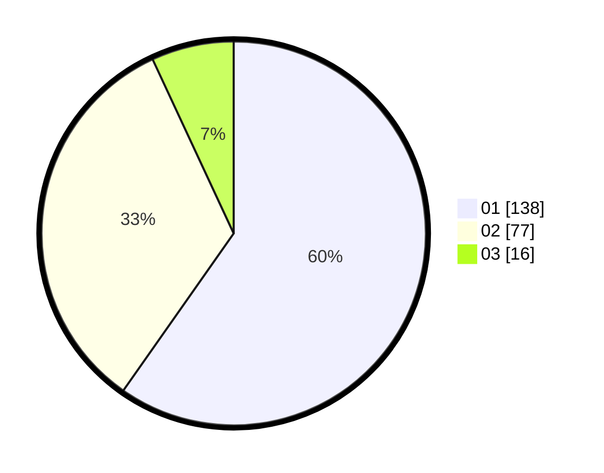

# Hasil

Hasil perolehan suara paslon dapat dilihat pada file paslon-01.txt, paslon-02.txt, dan paslon-03.txt.

Jika tidak ada, artinya data tersebut belum ada pada SIREKAP.

## Perolehan Suara

 * Paslon 01: **138**.
 * Paslon 02: **77**.
 * Paslon 03: **16**.

## Foto C Plano

https://sirekap-obj-formc.kpu.go.id/1c44/pemilu/ppwp/31/74/08/10/02/3174081002119-20240215-062329--c9178a2c-eaa9-499c-821e-61c3673ffdbf.jpg

https://sirekap-obj-formc.kpu.go.id/1c44/pemilu/ppwp/31/74/08/10/02/3174081002119-20240215-062640--6fc2da85-5b2e-4ba4-b4b9-6b40dbbd759b.jpg

https://sirekap-obj-formc.kpu.go.id/1c44/pemilu/ppwp/31/74/08/10/02/3174081002119-20240215-062736--38368aa2-99d6-4a22-8ff2-18f2a88e2975.jpg

## DATA PEMILIH TETAP

Jumlah pemilih dalam DPT: **269**.
 * L: **137**.
 * P: **132**.

## DATA PENGGUNA HAK PILIH

Jumlah pengguna hak pilih dalam DPT: **227**.
 * L: **113**.
 * P: **114**.

Jumlah pengguna hak pilih dalam DPTb: **1**.
 * L: **0**.
 * P: **1**.

Jumlah pengguna hak pilih dalam DPK: **5**.
 * L: **2**.
 * P: **3**.

Jumlah pengguna hak pilih: **233**.
 * L: **232**.
 * P: **118**.

## JUMLAH SUARA SAH DAN TIDAK SAH

JUMLAH SELURUH SUARA SAH: **231**.

JUMLAH SUARA TIDAK SAH: **2**.

JUMLAH SELURUH SUARA SAH DAN SUARA TIDAK SAH: **233**.
