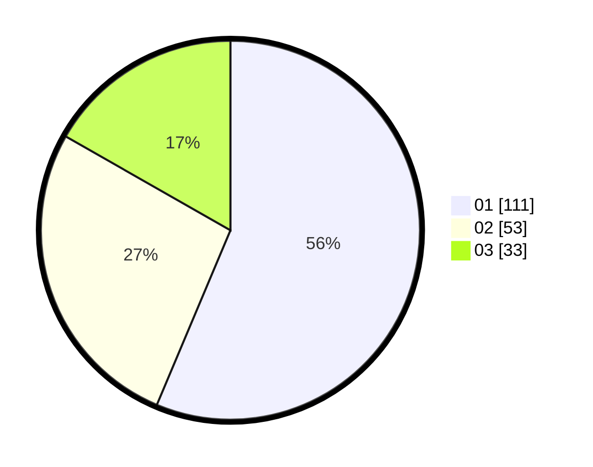

# Hasil

Hasil perolehan suara paslon dapat dilihat pada file paslon-01.txt, paslon-02.txt, dan paslon-03.txt.

Jika tidak ada, artinya data tersebut belum ada pada SIREKAP.

## Perolehan Suara

 * Paslon 01: **111**.
 * Paslon 02: **53**.
 * Paslon 03: **33**.

## Foto C Plano

https://sirekap-obj-formc.kpu.go.id/0c55/pemilu/ppwp/31/74/08/10/02/3174081002122-20240218-170951--29d3f8ac-6b90-406c-b587-593a56d6c704.jpg

https://sirekap-obj-formc.kpu.go.id/0c55/pemilu/ppwp/31/74/08/10/02/3174081002122-20240218-171450--d1a4547a-3488-48d3-8c48-ec38a90f7d5f.jpg

https://sirekap-obj-formc.kpu.go.id/0c55/pemilu/ppwp/31/74/08/10/02/3174081002122-20240218-171950--f7055f53-8b63-41df-ae4c-afcfa6c88cba.jpg

## DATA PEMILIH TETAP

Jumlah pemilih dalam DPT: **220**.
 * L: **107**.
 * P: **113**.

## DATA PENGGUNA HAK PILIH

Jumlah pengguna hak pilih dalam DPT: **186**.
 * L: **86**.
 * P: **100**.

Jumlah pengguna hak pilih dalam DPTb: **3**.
 * L: **1**.
 * P: **2**.

Jumlah pengguna hak pilih dalam DPK: **10**.
 * L: **6**.
 * P: **4**.

Jumlah pengguna hak pilih: **199**.
 * L: **93**.
 * P: **106**.

## JUMLAH SUARA SAH DAN TIDAK SAH

JUMLAH SELURUH SUARA SAH: **197**.

JUMLAH SUARA TIDAK SAH: **2**.

JUMLAH SELURUH SUARA SAH DAN SUARA TIDAK SAH: **199**.
