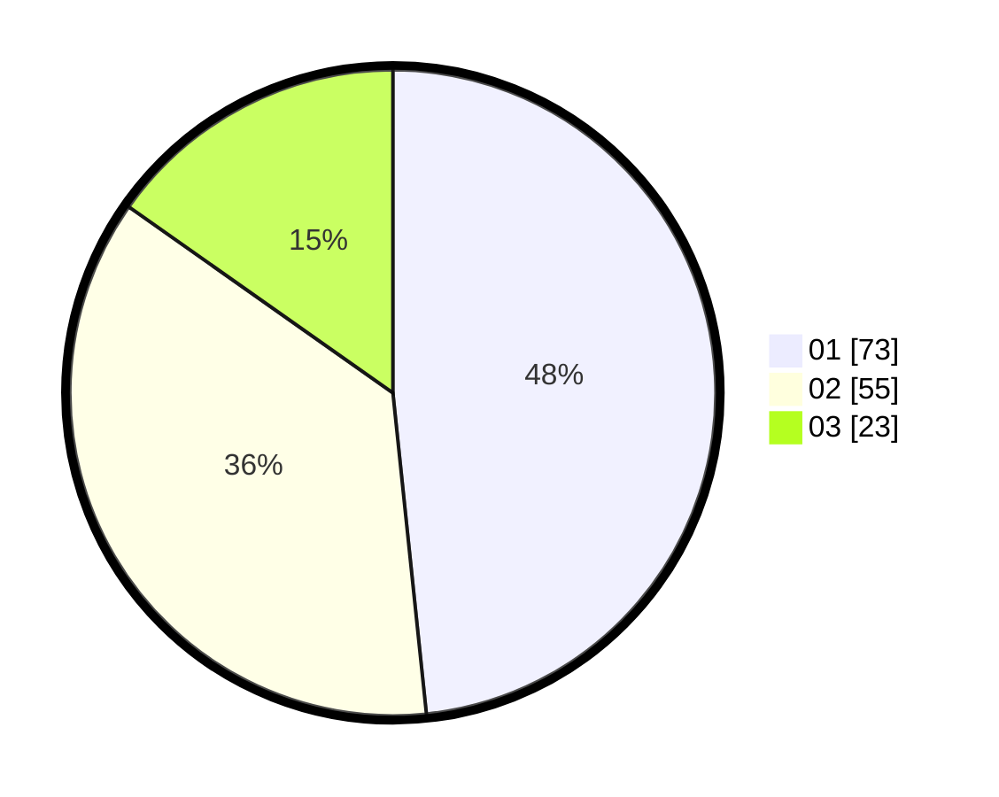

# Hasil

Hasil perolehan suara paslon dapat dilihat pada file paslon-01.txt, paslon-02.txt, dan paslon-03.txt.

Jika tidak ada, artinya data tersebut belum ada pada SIREKAP.

## Perolehan Suara

 * Paslon 01: **73**.
 * Paslon 02: **55**.
 * Paslon 03: **23**.

## Foto C Plano

https://sirekap-obj-formc.kpu.go.id/f991/pemilu/ppwp/31/74/08/10/02/3174081002123-20240215-123806--dcc7abb8-49cc-409b-ac28-7d6f9110b45a.jpg

https://sirekap-obj-formc.kpu.go.id/f991/pemilu/ppwp/31/74/08/10/02/3174081002123-20240215-123828--f425ea0a-9d3a-430f-a162-ece2dc11b0f6.jpg

https://sirekap-obj-formc.kpu.go.id/f991/pemilu/ppwp/31/74/08/10/02/3174081002123-20240215-123817--92abd26b-2620-496e-aa54-b0d215a05020.jpg

## DATA PEMILIH TETAP

Jumlah pemilih dalam DPT: **205**.
 * L: **98**.
 * P: **107**.

## DATA PENGGUNA HAK PILIH

Jumlah pengguna hak pilih dalam DPT: **152**.
 * L: **69**.
 * P: **83**.

Jumlah pengguna hak pilih dalam DPTb: **0**.
 * L: **0**.
 * P: **0**.

Jumlah pengguna hak pilih dalam DPK: **0**.
 * L: **0**.
 * P: **0**.

Jumlah pengguna hak pilih: **152**.
 * L: **69**.
 * P: **83**.

## JUMLAH SUARA SAH DAN TIDAK SAH

JUMLAH SELURUH SUARA SAH: **151**.

JUMLAH SUARA TIDAK SAH: **1**.

JUMLAH SELURUH SUARA SAH DAN SUARA TIDAK SAH: **152**.
