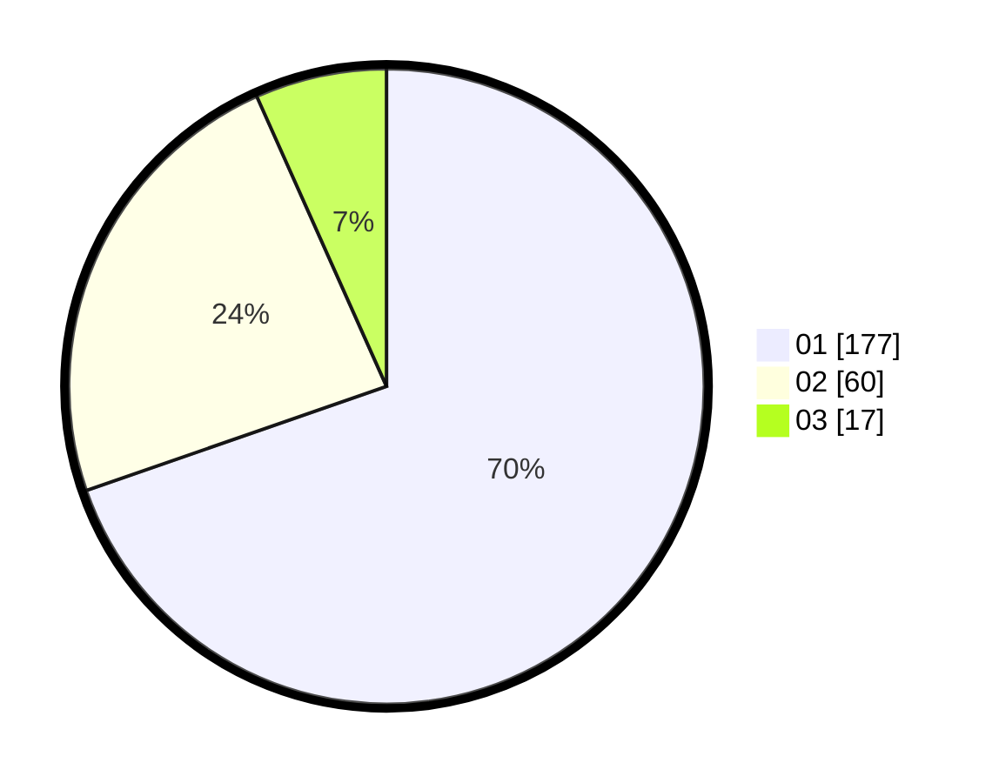

# Hasil

Hasil perolehan suara paslon dapat dilihat pada file paslon-01.txt, paslon-02.txt, dan paslon-03.txt.

Jika tidak ada, artinya data tersebut belum ada pada SIREKAP.

## Perolehan Suara

 * Paslon 01: **177**.
 * Paslon 02: **60**.
 * Paslon 03: **17**.

## Foto C Plano

https://sirekap-obj-formc.kpu.go.id/f1c1/pemilu/ppwp/31/74/08/10/02/3174081002125-20240214-184613--07b5e1f4-666a-495c-98d2-decca85184bd.jpg

https://sirekap-obj-formc.kpu.go.id/f1c1/pemilu/ppwp/31/74/08/10/02/3174081002125-20240214-193212--b85290b7-953a-4ce5-9f60-1852c47b33c3.jpg

https://sirekap-obj-formc.kpu.go.id/f1c1/pemilu/ppwp/31/74/08/10/02/3174081002125-20240214-193312--dc8c8e15-8e17-494c-b5f7-4f6a3d00cb54.jpg

## DATA PEMILIH TETAP

Jumlah pemilih dalam DPT: **299**.
 * L: **149**.
 * P: **150**.

## DATA PENGGUNA HAK PILIH

Jumlah pengguna hak pilih dalam DPT: **254**.
 * L: **123**.
 * P: **131**.

Jumlah pengguna hak pilih dalam DPTb: **8**.
 * L: **0**.
 * P: **0**.

Jumlah pengguna hak pilih dalam DPK: **2**.
 * L: **0**.
 * P: **2**.

Jumlah pengguna hak pilih: **256**.
 * L: **123**.
 * P: **133**.

## JUMLAH SUARA SAH DAN TIDAK SAH

JUMLAH SELURUH SUARA SAH: **254**.

JUMLAH SUARA TIDAK SAH: **2**.

JUMLAH SELURUH SUARA SAH DAN SUARA TIDAK SAH: **256**.
