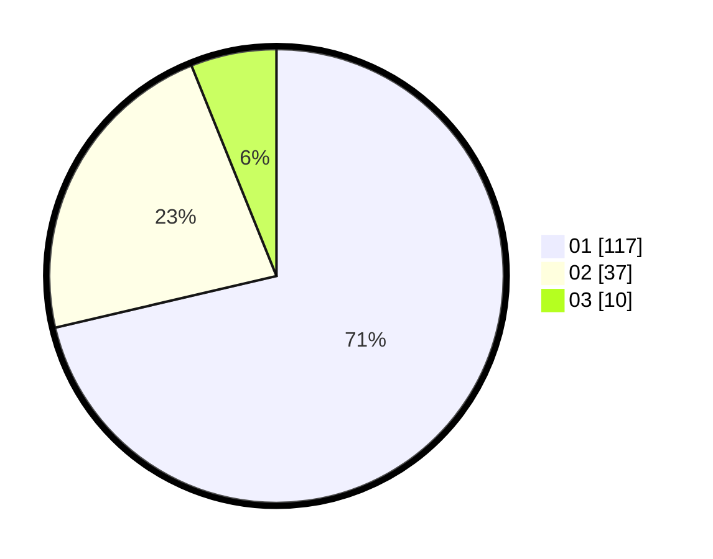

# Hasil

Hasil perolehan suara paslon dapat dilihat pada file paslon-01.txt, paslon-02.txt, dan paslon-03.txt.

Jika tidak ada, artinya data tersebut belum ada pada SIREKAP.

## Perolehan Suara

 * Paslon 01: **117**.
 * Paslon 02: **37**.
 * Paslon 03: **10**.

## Foto C Plano

https://sirekap-obj-formc.kpu.go.id/0e3f/pemilu/ppwp/31/74/08/10/02/3174081002130-20240214-202949--31890907-9701-4aa6-b0d7-44f3e0e6a807.jpg

https://sirekap-obj-formc.kpu.go.id/0e3f/pemilu/ppwp/31/74/08/10/02/3174081002130-20240218-190427--3117a843-96d7-4c70-8bb3-1f970c70c53f.jpg

https://sirekap-obj-formc.kpu.go.id/0e3f/pemilu/ppwp/31/74/08/10/02/3174081002130-20240214-202958--18640f03-b9e2-4069-a13c-b81118f8b72d.jpg

## DATA PEMILIH TETAP

Jumlah pemilih dalam DPT: **200**.
 * L: **105**.
 * P: **95**.

## DATA PENGGUNA HAK PILIH

Jumlah pengguna hak pilih dalam DPT: **165**.
 * L: **90**.
 * P: **75**.

Jumlah pengguna hak pilih dalam DPTb: **1**.
 * L: **0**.
 * P: **1**.

Jumlah pengguna hak pilih dalam DPK: **0**.
 * L: **0**.
 * P: **0**.

Jumlah pengguna hak pilih: **166**.
 * L: **90**.
 * P: **76**.

## JUMLAH SUARA SAH DAN TIDAK SAH

JUMLAH SELURUH SUARA SAH: **164**.

JUMLAH SUARA TIDAK SAH: **2**.

JUMLAH SELURUH SUARA SAH DAN SUARA TIDAK SAH: **166**.
