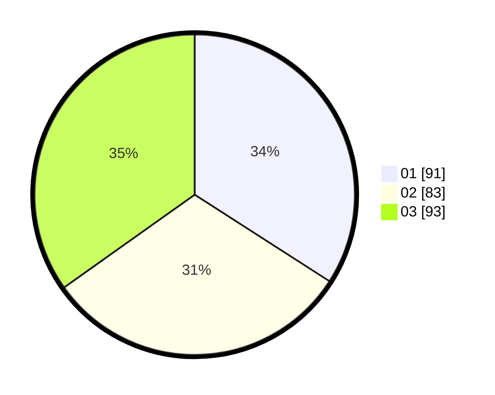

# Hasil

Hasil perolehan suara paslon dapat dilihat pada file paslon-01.txt, paslon-02.txt, dan paslon-03.txt.

Jika tidak ada, artinya data tersebut belum ada pada SIREKAP.

## Perolehan Suara

 * Paslon 01: **91**.
 * Paslon 02: **83**.
 * Paslon 03: **93**.

## Foto C Plano

https://sirekap-obj-formc.kpu.go.id/be1c/pemilu/ppwp/31/74/08/10/02/3174081002131-20240218-123327--047e1a0b-33ab-40d9-a97a-9f28dfb7a62d.jpg

https://sirekap-obj-formc.kpu.go.id/be1c/pemilu/ppwp/31/74/08/10/02/3174081002131-20240218-114430--a5aa63df-8b00-412f-baa4-f84b176e3c17.jpg

https://sirekap-obj-formc.kpu.go.id/be1c/pemilu/ppwp/31/74/08/10/02/3174081002131-20240218-123409--4a73fb09-2a51-46ff-90c5-343b24cecb10.jpg
