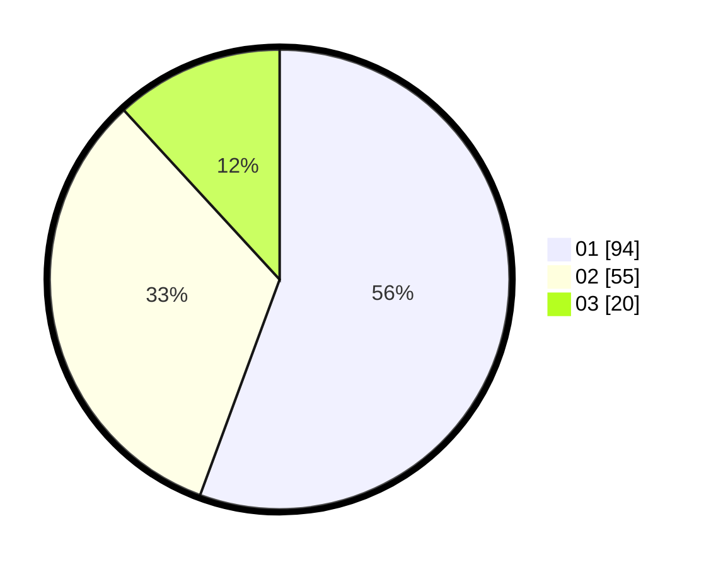

# Hasil

Hasil perolehan suara paslon dapat dilihat pada file paslon-01.txt, paslon-02.txt, dan paslon-03.txt.

Jika tidak ada, artinya data tersebut belum ada pada SIREKAP.

## Perolehan Suara

 * Paslon 01: **94**.
 * Paslon 02: **55**.
 * Paslon 03: **20**.

## Foto C Plano

https://sirekap-obj-formc.kpu.go.id/585a/pemilu/ppwp/31/74/08/10/02/3174081002139-20240214-160118--67b453d8-6786-4a9b-8b03-5b58a0e0fecc.jpg

https://sirekap-obj-formc.kpu.go.id/585a/pemilu/ppwp/31/74/08/10/02/3174081002139-20240214-195135--4ca92818-b180-4748-9b40-f533d65cb5cc.jpg

https://sirekap-obj-formc.kpu.go.id/585a/pemilu/ppwp/31/74/08/10/02/3174081002139-20240214-195220--0af6db68-50fd-40f5-b723-90b7aa7c1f5d.jpg

## DATA PEMILIH TETAP

Jumlah pemilih dalam DPT: **216**.
 * L: **429**.
 * P: **88**.

## DATA PENGGUNA HAK PILIH

Jumlah pengguna hak pilih dalam DPT: **168**.
 * L: **82**.
 * P: **86**.

Jumlah pengguna hak pilih dalam DPTb: **1**.
 * L: **1**.
 * P: **0**.

Jumlah pengguna hak pilih dalam DPK: **3**.
 * L: **2**.
 * P: **1**.

Jumlah pengguna hak pilih: **172**.
 * L: **85**.
 * P: **87**.

## JUMLAH SUARA SAH DAN TIDAK SAH

JUMLAH SELURUH SUARA SAH: **169**.

JUMLAH SUARA TIDAK SAH: **3**.

JUMLAH SELURUH SUARA SAH DAN SUARA TIDAK SAH: **172**.
