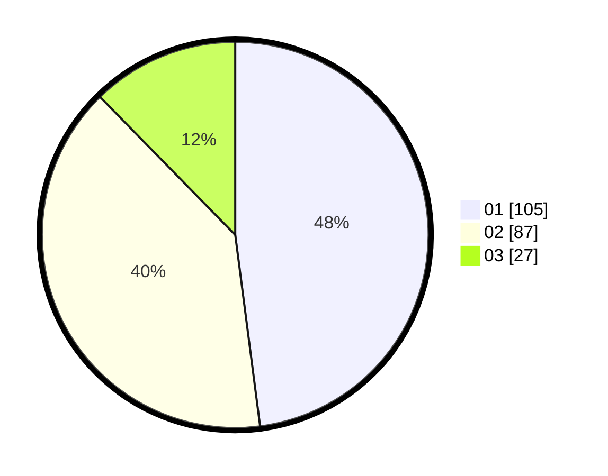

# Hasil

Hasil perolehan suara paslon dapat dilihat pada file paslon-01.txt, paslon-02.txt, dan paslon-03.txt.

Jika tidak ada, artinya data tersebut belum ada pada SIREKAP.

## Perolehan Suara

 * Paslon 01: **105**.
 * Paslon 02: **87**.
 * Paslon 03: **27**.

## Foto C Plano

https://sirekap-obj-formc.kpu.go.id/bcff/pemilu/ppwp/31/74/08/10/02/3174081002142-20240218-203920--a5318cb5-6605-43cf-8d69-0ea8216c54df.jpg

https://sirekap-obj-formc.kpu.go.id/bcff/pemilu/ppwp/31/74/08/10/02/3174081002142-20240218-193517--5243b059-b7e5-4aca-ade8-96f74faf4f85.jpg

https://sirekap-obj-formc.kpu.go.id/bcff/pemilu/ppwp/31/74/08/10/02/3174081002142-20240218-194250--156a9194-2551-4571-825a-53436273f204.jpg

## DATA PEMILIH TETAP

Jumlah pemilih dalam DPT: **272**.
 * L: **131**.
 * P: **141**.

## DATA PENGGUNA HAK PILIH

Jumlah pengguna hak pilih dalam DPT: **213**.
 * L: **96**.
 * P: **117**.

Jumlah pengguna hak pilih dalam DPTb: **6**.
 * L: **3**.
 * P: **3**.

Jumlah pengguna hak pilih dalam DPK: **1**.
 * L: **0**.
 * P: **1**.

Jumlah pengguna hak pilih: **220**.
 * L: **99**.
 * P: **121**.

## JUMLAH SUARA SAH DAN TIDAK SAH

JUMLAH SELURUH SUARA SAH: **219**.

JUMLAH SUARA TIDAK SAH: **1**.

JUMLAH SELURUH SUARA SAH DAN SUARA TIDAK SAH: **220**.
