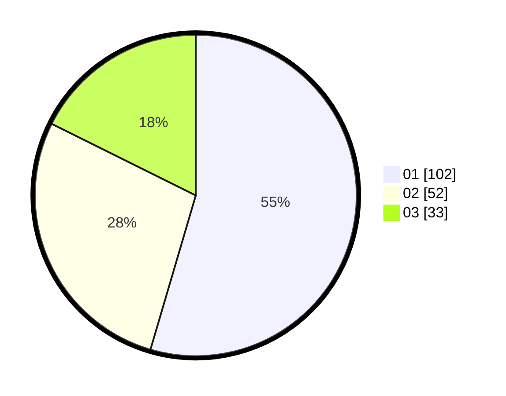

# Hasil

Hasil perolehan suara paslon dapat dilihat pada file paslon-01.txt, paslon-02.txt, dan paslon-03.txt.

Jika tidak ada, artinya data tersebut belum ada pada SIREKAP.

## Perolehan Suara

 * Paslon 01: **102**.
 * Paslon 02: **52**.
 * Paslon 03: **33**.

## Foto C Plano

https://sirekap-obj-formc.kpu.go.id/be4a/pemilu/ppwp/31/74/08/10/02/3174081002147-20240218-173709--c0a77684-ec30-429c-943f-0213f2051975.jpg

https://sirekap-obj-formc.kpu.go.id/be4a/pemilu/ppwp/31/74/08/10/02/3174081002147-20240219-144455--6a52453e-2932-4466-b3b5-c2cfe5626beb.jpg

https://sirekap-obj-formc.kpu.go.id/be4a/pemilu/ppwp/31/74/08/10/02/3174081002147-20240219-143754--76565b2a-024c-4249-8ba6-8145ec868ccc.jpg

## DATA PEMILIH TETAP

Jumlah pemilih dalam DPT: **236**.
 * L: **116**.
 * P: **120**.

## DATA PENGGUNA HAK PILIH

Jumlah pengguna hak pilih dalam DPT: **191**.
 * L: **89**.
 * P: **102**.

Jumlah pengguna hak pilih dalam DPTb: **0**.
 * L: **0**.
 * P: **0**.

Jumlah pengguna hak pilih dalam DPK: **0**.
 * L: **0**.
 * P: **0**.

Jumlah pengguna hak pilih: **191**.
 * L: **89**.
 * P: **102**.

## JUMLAH SUARA SAH DAN TIDAK SAH

JUMLAH SELURUH SUARA SAH: **187**.

JUMLAH SUARA TIDAK SAH: **4**.

JUMLAH SELURUH SUARA SAH DAN SUARA TIDAK SAH: **191**.
