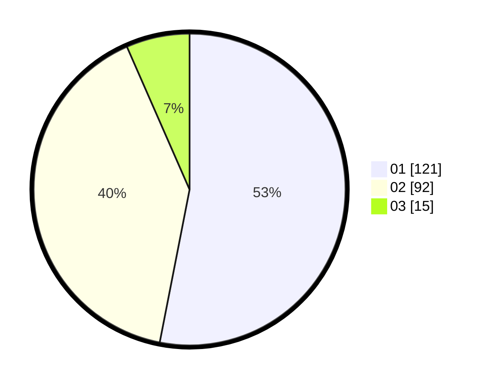

# Hasil

Hasil perolehan suara paslon dapat dilihat pada file paslon-01.txt, paslon-02.txt, dan paslon-03.txt.

Jika tidak ada, artinya data tersebut belum ada pada SIREKAP.

## Perolehan Suara

 * Paslon 01: **121**.
 * Paslon 02: **92**.
 * Paslon 03: **15**.

## Foto C Plano

https://sirekap-obj-formc.kpu.go.id/fc78/pemilu/ppwp/31/74/08/10/03/3174081003007-20240214-225329--d5081f3d-e2e0-4252-affa-464357295bba.jpg

https://sirekap-obj-formc.kpu.go.id/fc78/pemilu/ppwp/31/74/08/10/03/3174081003007-20240214-225447--8613e0f3-20ba-4a87-b41f-10b6a6912077.jpg

https://sirekap-obj-formc.kpu.go.id/fc78/pemilu/ppwp/31/74/08/10/03/3174081003007-20240214-225711--e6297ff9-efd7-4e67-80f4-6de9f8bc3a77.jpg

## DATA PEMILIH TETAP

Jumlah pemilih dalam DPT: **256**.
 * L: **129**.
 * P: **127**.

## DATA PENGGUNA HAK PILIH

Jumlah pengguna hak pilih dalam DPT: **224**.
 * L: **109**.
 * P: **115**.

Jumlah pengguna hak pilih dalam DPTb: **9**.
 * L: **5**.
 * P: **4**.

Jumlah pengguna hak pilih dalam DPK: **1**.
 * L: **0**.
 * P: **1**.

Jumlah pengguna hak pilih: **234**.
 * L: **114**.
 * P: **120**.

## JUMLAH SUARA SAH DAN TIDAK SAH

JUMLAH SELURUH SUARA SAH: **228**.

JUMLAH SUARA TIDAK SAH: **6**.

JUMLAH SELURUH SUARA SAH DAN SUARA TIDAK SAH: **234**.
