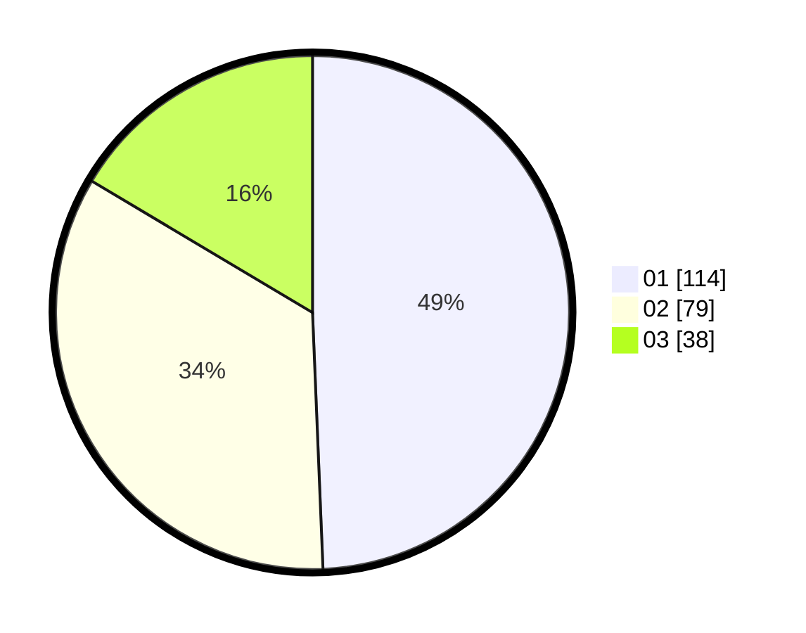

# Hasil

Hasil perolehan suara paslon dapat dilihat pada file paslon-01.txt, paslon-02.txt, dan paslon-03.txt.

Jika tidak ada, artinya data tersebut belum ada pada SIREKAP.

## Perolehan Suara

 * Paslon 01: **114**.
 * Paslon 02: **79**.
 * Paslon 03: **38**.

## Foto C Plano

https://sirekap-obj-formc.kpu.go.id/c2dd/pemilu/ppwp/31/74/08/10/03/3174081003012-20240214-225440--743df2fe-2c37-4bdd-9b97-9cb44d6d1872.jpg

https://sirekap-obj-formc.kpu.go.id/c2dd/pemilu/ppwp/31/74/08/10/03/3174081003012-20240214-225134--2e22f240-762e-4aeb-9198-e2def997d87f.jpg

https://sirekap-obj-formc.kpu.go.id/c2dd/pemilu/ppwp/31/74/08/10/03/3174081003012-20240214-225214--b2da69c5-264d-4943-a708-eb87a3f4d85a.jpg

## DATA PEMILIH TETAP

Jumlah pemilih dalam DPT: **284**.
 * L: **140**.
 * P: **144**.

## DATA PENGGUNA HAK PILIH

Jumlah pengguna hak pilih dalam DPT: **202**.
 * L: **100**.
 * P: **102**.

Jumlah pengguna hak pilih dalam DPTb: **22**.
 * L: **13**.
 * P: **9**.

Jumlah pengguna hak pilih dalam DPK: **7**.
 * L: **1**.
 * P: **6**.

Jumlah pengguna hak pilih: **231**.
 * L: **114**.
 * P: **117**.

## JUMLAH SUARA SAH DAN TIDAK SAH

JUMLAH SELURUH SUARA SAH: **231**.

JUMLAH SUARA TIDAK SAH: **2**.

JUMLAH SELURUH SUARA SAH DAN SUARA TIDAK SAH: **233**.
