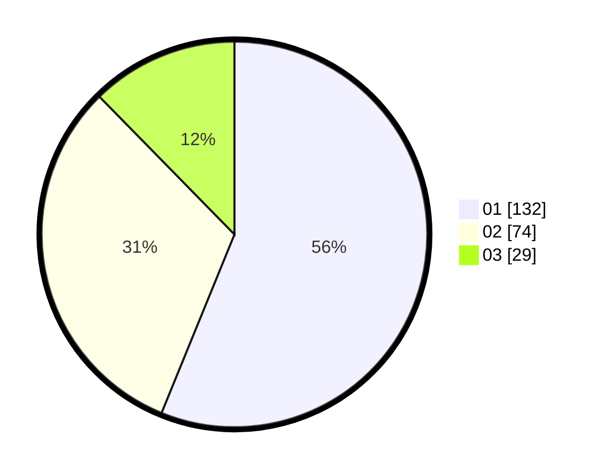

# Hasil

Hasil perolehan suara paslon dapat dilihat pada file paslon-01.txt, paslon-02.txt, dan paslon-03.txt.

Jika tidak ada, artinya data tersebut belum ada pada SIREKAP.

## Perolehan Suara

 * Paslon 01: **132**.
 * Paslon 02: **74**.
 * Paslon 03: **29**.

## Foto C Plano

https://sirekap-obj-formc.kpu.go.id/6826/pemilu/ppwp/31/74/08/10/03/3174081003019-20240214-155117--44a68999-d7b0-4893-97d0-103ec86cc720.jpg

https://sirekap-obj-formc.kpu.go.id/6826/pemilu/ppwp/31/74/08/10/03/3174081003019-20240214-155332--630b058c-c94b-4b42-929b-fd98fbea83db.jpg

https://sirekap-obj-formc.kpu.go.id/6826/pemilu/ppwp/31/74/08/10/03/3174081003019-20240214-155407--a1a8c5b7-b738-42a5-9874-2135a2a8b7cf.jpg

## DATA PEMILIH TETAP

Jumlah pemilih dalam DPT: **283**.
 * L: **143**.
 * P: **140**.

## DATA PENGGUNA HAK PILIH

Jumlah pengguna hak pilih dalam DPT: **218**.
 * L: **108**.
 * P: **110**.

Jumlah pengguna hak pilih dalam DPTb: **18**.
 * L: **5**.
 * P: **13**.

Jumlah pengguna hak pilih dalam DPK: **2**.
 * L: **1**.
 * P: **1**.

Jumlah pengguna hak pilih: **238**.
 * L: **114**.
 * P: **124**.

## JUMLAH SUARA SAH DAN TIDAK SAH

JUMLAH SELURUH SUARA SAH: **235**.

JUMLAH SUARA TIDAK SAH: **3**.

JUMLAH SELURUH SUARA SAH DAN SUARA TIDAK SAH: **238**.
