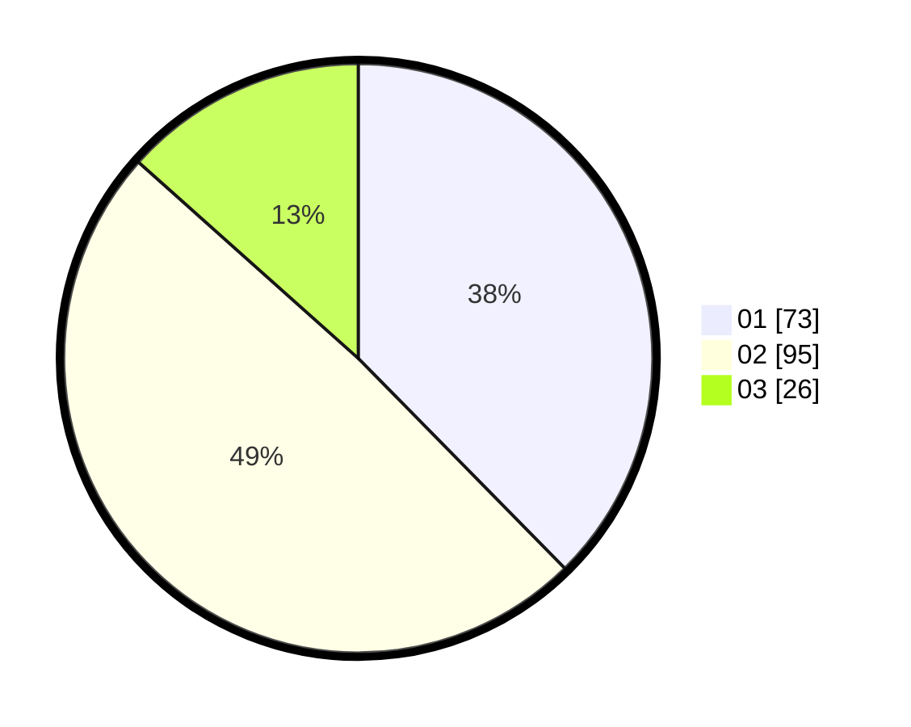

# Hasil

Hasil perolehan suara paslon dapat dilihat pada file paslon-01.txt, paslon-02.txt, dan paslon-03.txt.

Jika tidak ada, artinya data tersebut belum ada pada SIREKAP.

## Perolehan Suara

 * Paslon 01: **73**.
 * Paslon 02: **95**.
 * Paslon 03: **26**.

## Foto C Plano

https://sirekap-obj-formc.kpu.go.id/5fc2/pemilu/ppwp/31/74/08/10/03/3174081003025-20240214-211515--6c6a5a32-1a1b-4fe6-92b0-74213f4f0af9.jpg

https://sirekap-obj-formc.kpu.go.id/5fc2/pemilu/ppwp/31/74/08/10/03/3174081003025-20240214-211612--df5a1cc5-2892-4fa2-b818-025069c3e9ea.jpg

https://sirekap-obj-formc.kpu.go.id/5fc2/pemilu/ppwp/31/74/08/10/03/3174081003025-20240214-211715--fbeec6a6-0f2a-41c9-b354-0db2d9d3a08e.jpg

## DATA PEMILIH TETAP

Jumlah pemilih dalam DPT: **227**.
 * L: **100**.
 * P: **127**.

## DATA PENGGUNA HAK PILIH

Jumlah pengguna hak pilih dalam DPT: **180**.
 * L: **80**.
 * P: **100**.

Jumlah pengguna hak pilih dalam DPTb: **15**.
 * L: **6**.
 * P: **9**.

Jumlah pengguna hak pilih dalam DPK: **1**.
 * L: **1**.
 * P: **0**.

Jumlah pengguna hak pilih: **196**.
 * L: **87**.
 * P: **109**.

## JUMLAH SUARA SAH DAN TIDAK SAH

JUMLAH SELURUH SUARA SAH: **194**.

JUMLAH SUARA TIDAK SAH: **2**.

JUMLAH SELURUH SUARA SAH DAN SUARA TIDAK SAH: **196**.
