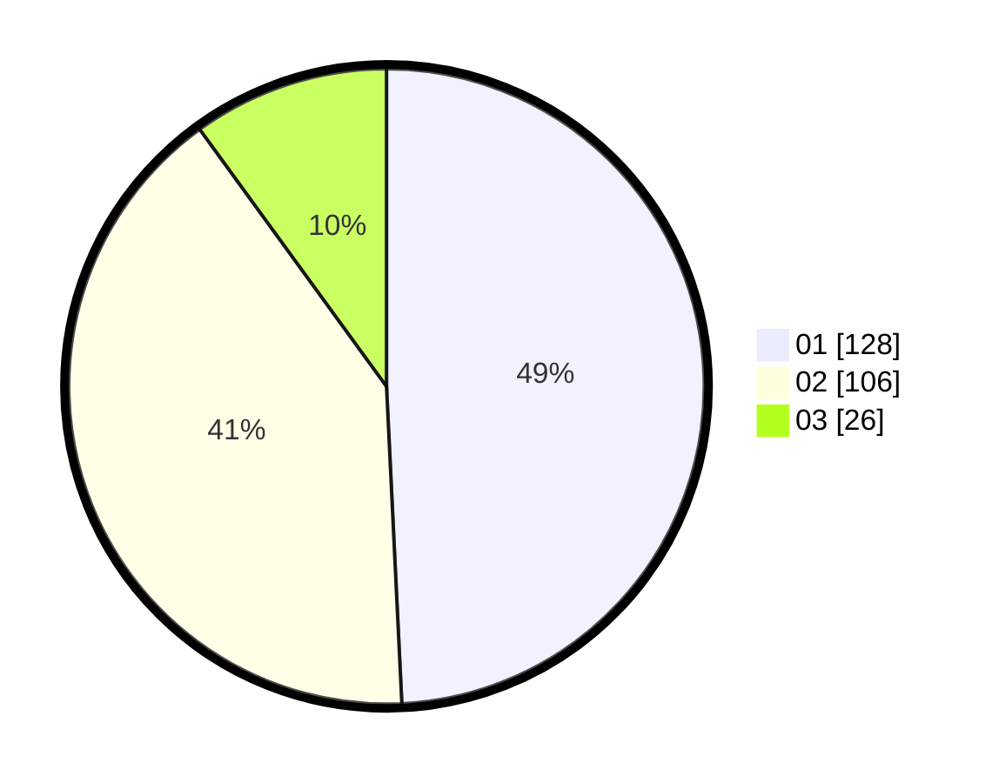

# Hasil

Hasil perolehan suara paslon dapat dilihat pada file paslon-01.txt, paslon-02.txt, dan paslon-03.txt.

Jika tidak ada, artinya data tersebut belum ada pada SIREKAP.

## Perolehan Suara

 * Paslon 01: **128**.
 * Paslon 02: **106**.
 * Paslon 03: **26**.

## Foto C Plano

https://sirekap-obj-formc.kpu.go.id/db4b/pemilu/ppwp/31/74/08/10/03/3174081003044-20240214-230039--3815d1a3-440c-4153-8175-39dd07fd190f.jpg

https://sirekap-obj-formc.kpu.go.id/db4b/pemilu/ppwp/31/74/08/10/03/3174081003044-20240214-230150--4d9c377f-2df6-426b-a860-c2309eb86ccb.jpg

https://sirekap-obj-formc.kpu.go.id/db4b/pemilu/ppwp/31/74/08/10/03/3174081003044-20240214-230251--9ff24ecf-0357-4a82-9f76-0c57f7f69f4a.jpg

## DATA PEMILIH TETAP

Jumlah pemilih dalam DPT: **242**.
 * L: **64**.
 * P: **178**.

## DATA PENGGUNA HAK PILIH

Jumlah pengguna hak pilih dalam DPT: **242**.
 * L: **64**.
 * P: **178**.

Jumlah pengguna hak pilih dalam DPTb: **19**.
 * L: **7**.
 * P: **12**.

Jumlah pengguna hak pilih dalam DPK: **2**.
 * L: **0**.
 * P: **2**.

Jumlah pengguna hak pilih: **263**.
 * L: **71**.
 * P: **192**.

## JUMLAH SUARA SAH DAN TIDAK SAH

JUMLAH SELURUH SUARA SAH: **260**.

JUMLAH SUARA TIDAK SAH: **3**.

JUMLAH SELURUH SUARA SAH DAN SUARA TIDAK SAH: **263**.
