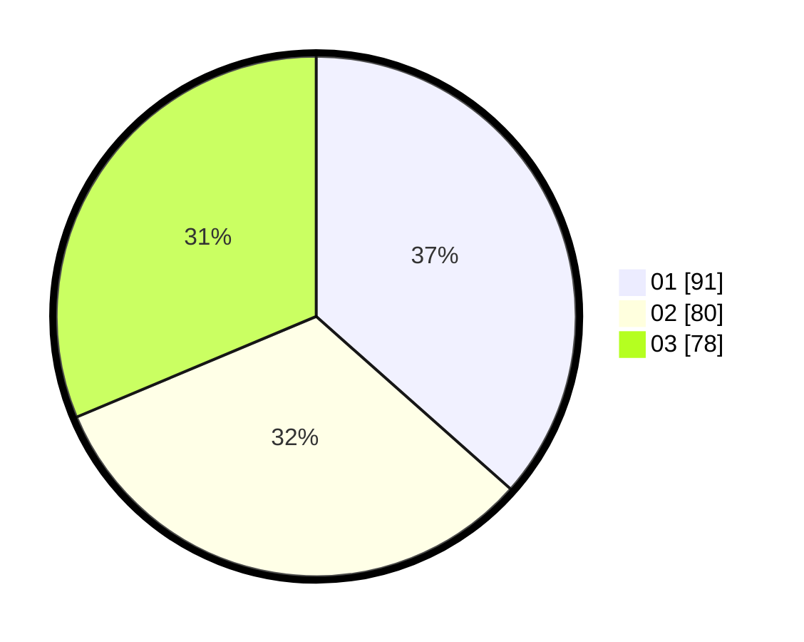

# Hasil

Hasil perolehan suara paslon dapat dilihat pada file paslon-01.txt, paslon-02.txt, dan paslon-03.txt.

Jika tidak ada, artinya data tersebut belum ada pada SIREKAP.

## Perolehan Suara

 * Paslon 01: **91**.
 * Paslon 02: **80**.
 * Paslon 03: **78**.

## Foto C Plano

https://sirekap-obj-formc.kpu.go.id/ee7f/pemilu/ppwp/31/74/08/10/03/3174081003051-20240214-212214--36fa94f8-b739-49aa-b241-e5c993f8d5a7.jpg

https://sirekap-obj-formc.kpu.go.id/ee7f/pemilu/ppwp/31/74/08/10/03/3174081003051-20240214-212412--fb58b183-c83a-4e36-b2a8-4fdbd0adfa96.jpg

https://sirekap-obj-formc.kpu.go.id/ee7f/pemilu/ppwp/31/74/08/10/03/3174081003051-20240214-212510--8b04867b-6770-4408-863f-6d4ba7f02b71.jpg

## DATA PEMILIH TETAP

Jumlah pemilih dalam DPT: **282**.
 * L: **131**.
 * P: **151**.

## DATA PENGGUNA HAK PILIH

Jumlah pengguna hak pilih dalam DPT: **235**.
 * L: **110**.
 * P: **125**.

Jumlah pengguna hak pilih dalam DPTb: **16**.
 * L: **7**.
 * P: **9**.

Jumlah pengguna hak pilih dalam DPK: **1**.
 * L: **0**.
 * P: **1**.

Jumlah pengguna hak pilih: **252**.
 * L: **117**.
 * P: **135**.

## JUMLAH SUARA SAH DAN TIDAK SAH

JUMLAH SELURUH SUARA SAH: **249**.

JUMLAH SUARA TIDAK SAH: **3**.

JUMLAH SELURUH SUARA SAH DAN SUARA TIDAK SAH: **252**.
