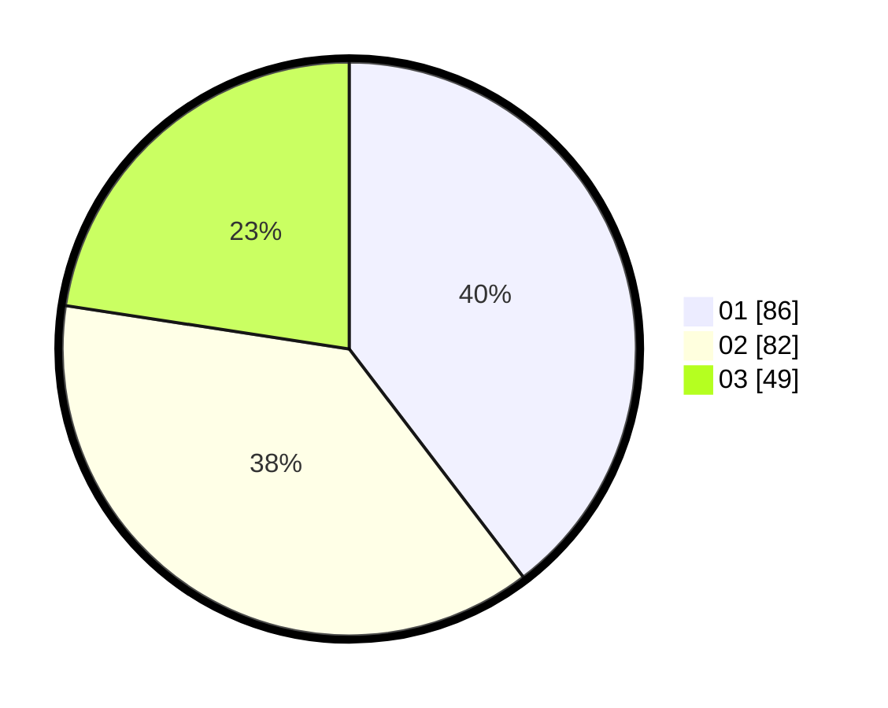

# Hasil

Hasil perolehan suara paslon dapat dilihat pada file paslon-01.txt, paslon-02.txt, dan paslon-03.txt.

Jika tidak ada, artinya data tersebut belum ada pada SIREKAP.

## Perolehan Suara

 * Paslon 01: **86**.
 * Paslon 02: **82**.
 * Paslon 03: **49**.

## Foto C Plano

https://sirekap-obj-formc.kpu.go.id/141f/pemilu/ppwp/31/74/08/10/03/3174081003070-20240214-201120--9b589569-70ae-4c4b-9df0-973d0544e14f.jpg

https://sirekap-obj-formc.kpu.go.id/141f/pemilu/ppwp/31/74/08/10/03/3174081003070-20240214-201156--a28312d4-f50c-4c8c-9309-edc08e08b9b0.jpg

https://sirekap-obj-formc.kpu.go.id/141f/pemilu/ppwp/31/74/08/10/03/3174081003070-20240214-201216--d92b807d-b049-4d9c-ab11-64aa974fd030.jpg

## DATA PEMILIH TETAP

Jumlah pemilih dalam DPT: **292**.
 * L: **137**.
 * P: **155**.

## DATA PENGGUNA HAK PILIH

Jumlah pengguna hak pilih dalam DPT: **182**.
 * L: **82**.
 * P: **100**.

Jumlah pengguna hak pilih dalam DPTb: **21**.
 * L: **15**.
 * P: **6**.

Jumlah pengguna hak pilih dalam DPK: **16**.
 * L: **8**.
 * P: **8**.

Jumlah pengguna hak pilih: **219**.
 * L: **105**.
 * P: **114**.

## JUMLAH SUARA SAH DAN TIDAK SAH

JUMLAH SELURUH SUARA SAH: **217**.

JUMLAH SUARA TIDAK SAH: **2**.

JUMLAH SELURUH SUARA SAH DAN SUARA TIDAK SAH: **219**.
