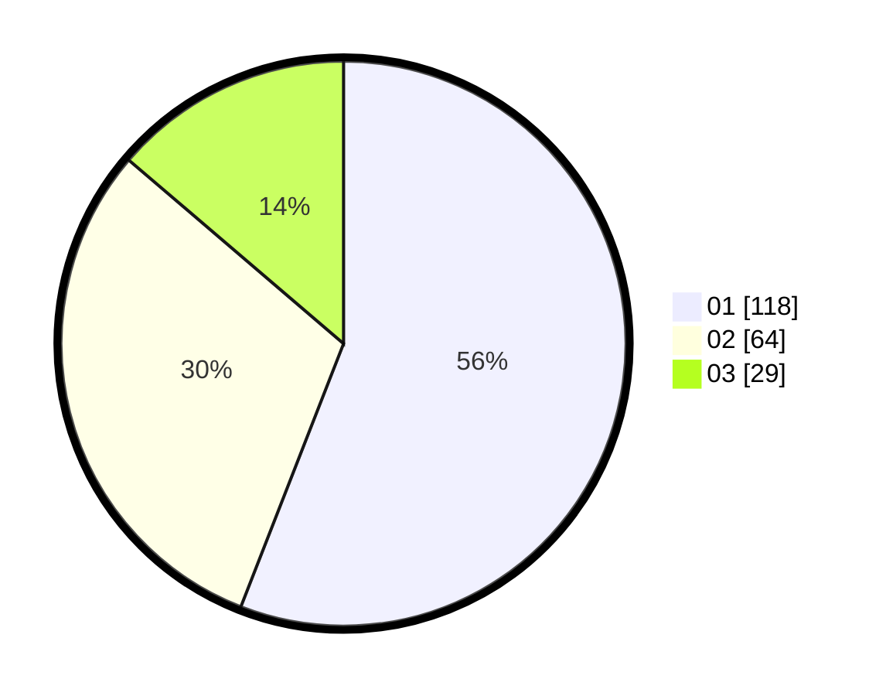

# Hasil

Hasil perolehan suara paslon dapat dilihat pada file paslon-01.txt, paslon-02.txt, dan paslon-03.txt.

Jika tidak ada, artinya data tersebut belum ada pada SIREKAP.

## Perolehan Suara

 * Paslon 01: **118**.
 * Paslon 02: **64**.
 * Paslon 03: **29**.

## Foto C Plano

https://sirekap-obj-formc.kpu.go.id/7e80/pemilu/ppwp/31/74/08/10/04/3174081004002-20240217-175136--ba3fff15-c104-4264-b504-191033408623.jpg

https://sirekap-obj-formc.kpu.go.id/7e80/pemilu/ppwp/31/74/08/10/04/3174081004002-20240217-175357--3e02dd07-b139-4d1f-a761-a25d1c4fd8a0.jpg

https://sirekap-obj-formc.kpu.go.id/7e80/pemilu/ppwp/31/74/08/10/04/3174081004002-20240217-175743--89fc7e57-aa8a-4689-8880-d8f31963c386.jpg

## DATA PEMILIH TETAP

Jumlah pemilih dalam DPT: **257**.
 * L: **119**.
 * P: **138**.

## DATA PENGGUNA HAK PILIH

Jumlah pengguna hak pilih dalam DPT: **206**.
 * L: **96**.
 * P: **110**.

Jumlah pengguna hak pilih dalam DPTb: **4**.
 * L: **2**.
 * P: **2**.

Jumlah pengguna hak pilih dalam DPK: **3**.
 * L: **1**.
 * P: **2**.

Jumlah pengguna hak pilih: **213**.
 * L: **99**.
 * P: **114**.

## JUMLAH SUARA SAH DAN TIDAK SAH

JUMLAH SELURUH SUARA SAH: **211**.

JUMLAH SUARA TIDAK SAH: **2**.

JUMLAH SELURUH SUARA SAH DAN SUARA TIDAK SAH: **213**.
