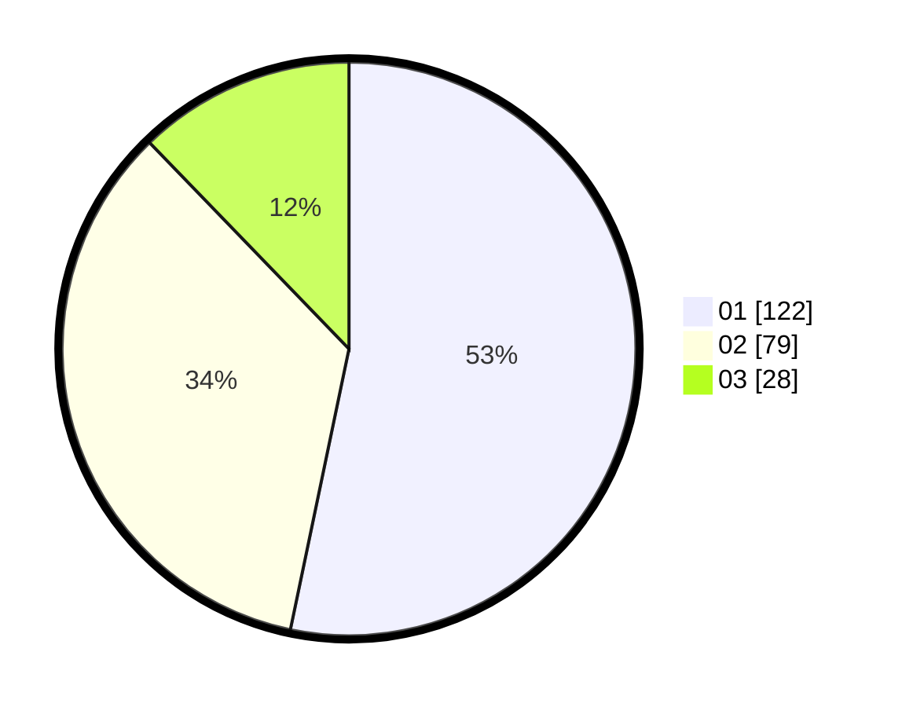

# Hasil

Hasil perolehan suara paslon dapat dilihat pada file paslon-01.txt, paslon-02.txt, dan paslon-03.txt.

Jika tidak ada, artinya data tersebut belum ada pada SIREKAP.

## Perolehan Suara

 * Paslon 01: **122**.
 * Paslon 02: **79**.
 * Paslon 03: **28**.

## Foto C Plano

https://sirekap-obj-formc.kpu.go.id/e792/pemilu/ppwp/31/74/08/10/04/3174081004003-20240214-155336--8e6e2087-56b0-4c6c-a6b0-0121e185f0d3.jpg

https://sirekap-obj-formc.kpu.go.id/e792/pemilu/ppwp/31/74/08/10/04/3174081004003-20240214-155418--ec8cabda-a4c0-4c0c-be4d-ae94e303e55b.jpg

https://sirekap-obj-formc.kpu.go.id/e792/pemilu/ppwp/31/74/08/10/04/3174081004003-20240214-155448--b55a20b3-94e1-4ccc-96ab-f58db5fa3f92.jpg

## DATA PEMILIH TETAP

Jumlah pemilih dalam DPT: **294**.
 * L: **153**.
 * P: **141**.

## DATA PENGGUNA HAK PILIH

Jumlah pengguna hak pilih dalam DPT: **221**.
 * L: **113**.
 * P: **108**.

Jumlah pengguna hak pilih dalam DPTb: **10**.
 * L: **5**.
 * P: **5**.

Jumlah pengguna hak pilih dalam DPK: **0**.
 * L: **0**.
 * P: **0**.

Jumlah pengguna hak pilih: **231**.
 * L: **118**.
 * P: **113**.

## JUMLAH SUARA SAH DAN TIDAK SAH

JUMLAH SELURUH SUARA SAH: **229**.

JUMLAH SUARA TIDAK SAH: **2**.

JUMLAH SELURUH SUARA SAH DAN SUARA TIDAK SAH: **231**.
