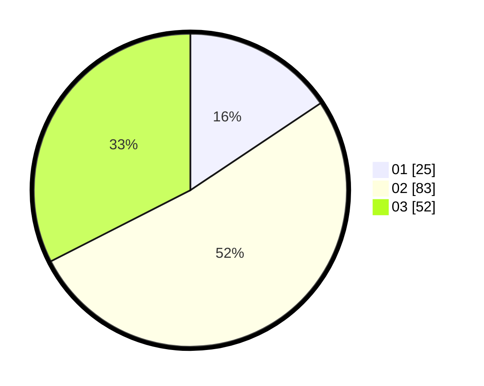

# Hasil

Hasil perolehan suara paslon dapat dilihat pada file paslon-01.txt, paslon-02.txt, dan paslon-03.txt.

Jika tidak ada, artinya data tersebut belum ada pada SIREKAP.

## Perolehan Suara

 * Paslon 01: **25**.
 * Paslon 02: **83**.
 * Paslon 03: **52**.

## Foto C Plano

https://sirekap-obj-formc.kpu.go.id/8bcc/pemilu/ppwp/31/74/08/10/04/3174081004006-20240218-204310--65b980a7-ef00-4ef4-a510-56b397ac45d8.jpg

https://sirekap-obj-formc.kpu.go.id/8bcc/pemilu/ppwp/31/74/08/10/04/3174081004006-20240218-204639--15ebfb5b-f125-4469-b02a-cebe627b8fe1.jpg

https://sirekap-obj-formc.kpu.go.id/8bcc/pemilu/ppwp/31/74/08/10/04/3174081004006-20240218-204509--d0cf42d3-0b04-4b71-993e-89e264b50b44.jpg

## DATA PEMILIH TETAP

Jumlah pemilih dalam DPT: **193**.
 * L: **91**.
 * P: **102**.

## DATA PENGGUNA HAK PILIH

Jumlah pengguna hak pilih dalam DPT: **154**.
 * L: **74**.
 * P: **80**.

Jumlah pengguna hak pilih dalam DPTb: **8**.
 * L: **3**.
 * P: **5**.

Jumlah pengguna hak pilih dalam DPK: **3**.
 * L: **1**.
 * P: **2**.

Jumlah pengguna hak pilih: **165**.
 * L: **78**.
 * P: **87**.

## JUMLAH SUARA SAH DAN TIDAK SAH

JUMLAH SELURUH SUARA SAH: **160**.

JUMLAH SUARA TIDAK SAH: **5**.

JUMLAH SELURUH SUARA SAH DAN SUARA TIDAK SAH: **165**.
