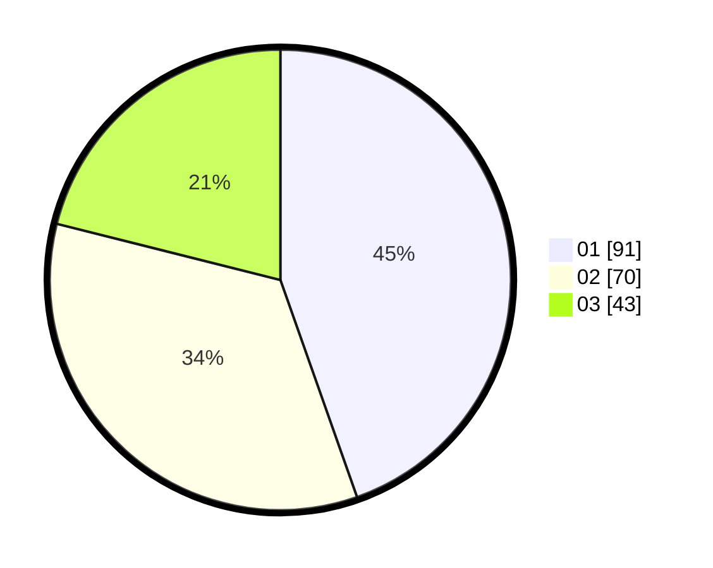

# Hasil

Hasil perolehan suara paslon dapat dilihat pada file paslon-01.txt, paslon-02.txt, dan paslon-03.txt.

Jika tidak ada, artinya data tersebut belum ada pada SIREKAP.

## Perolehan Suara

 * Paslon 01: **91**.
 * Paslon 02: **70**.
 * Paslon 03: **43**.

## Foto C Plano

https://sirekap-obj-formc.kpu.go.id/19a9/pemilu/ppwp/31/74/08/10/04/3174081004008-20240214-185128--1ef3f731-f19e-4bbe-8f1e-9c8b1fd74595.jpg

https://sirekap-obj-formc.kpu.go.id/19a9/pemilu/ppwp/31/74/08/10/04/3174081004008-20240214-190053--6236cd4d-72f9-4475-bff1-38b1f3070c2f.jpg

https://sirekap-obj-formc.kpu.go.id/19a9/pemilu/ppwp/31/74/08/10/04/3174081004008-20240214-185224--c2ff17d3-9067-43db-bd19-cb4b7281947f.jpg

## DATA PEMILIH TETAP

Jumlah pemilih dalam DPT: **264**.
 * L: **137**.
 * P: **127**.

## DATA PENGGUNA HAK PILIH

Jumlah pengguna hak pilih dalam DPT: **197**.
 * L: **98**.
 * P: **99**.

Jumlah pengguna hak pilih dalam DPTb: **8**.
 * L: **4**.
 * P: **4**.

Jumlah pengguna hak pilih dalam DPK: **0**.
 * L: **0**.
 * P: **0**.

Jumlah pengguna hak pilih: **205**.
 * L: **102**.
 * P: **103**.

## JUMLAH SUARA SAH DAN TIDAK SAH

JUMLAH SELURUH SUARA SAH: **204**.

JUMLAH SUARA TIDAK SAH: **1**.

JUMLAH SELURUH SUARA SAH DAN SUARA TIDAK SAH: **205**.
