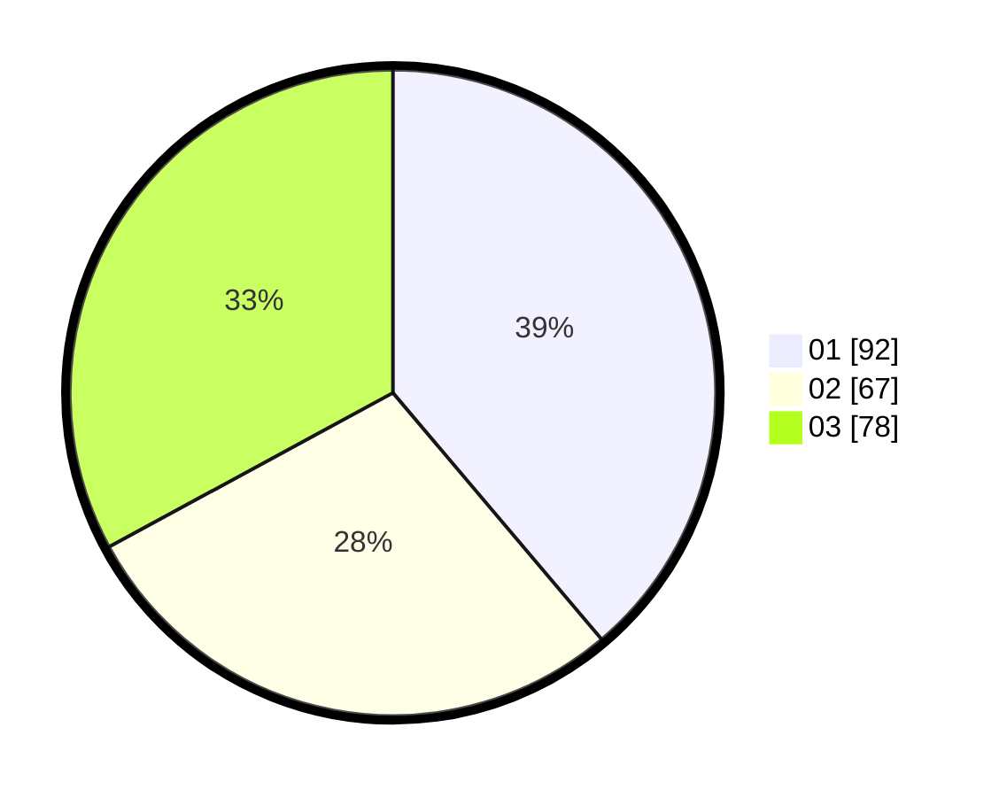

# Hasil

Hasil perolehan suara paslon dapat dilihat pada file paslon-01.txt, paslon-02.txt, dan paslon-03.txt.

Jika tidak ada, artinya data tersebut belum ada pada SIREKAP.

## Perolehan Suara

 * Paslon 01: **92**.
 * Paslon 02: **67**.
 * Paslon 03: **78**.

## Foto C Plano

https://sirekap-obj-formc.kpu.go.id/7873/pemilu/ppwp/31/74/08/10/04/3174081004010-20240214-195914--6fb13cdb-c0e6-4408-88f5-327c8fddbf47.jpg

https://sirekap-obj-formc.kpu.go.id/7873/pemilu/ppwp/31/74/08/10/04/3174081004010-20240214-200104--aab10af5-206a-4e42-bd80-3b7383ae18ec.jpg

https://sirekap-obj-formc.kpu.go.id/7873/pemilu/ppwp/31/74/08/10/04/3174081004010-20240214-200315--ea3ac372-6757-43c2-8c76-dd2f12cff0d4.jpg

## DATA PEMILIH TETAP

Jumlah pemilih dalam DPT: **270**.
 * L: **124**.
 * P: **146**.

## DATA PENGGUNA HAK PILIH

Jumlah pengguna hak pilih dalam DPT: **232**.
 * L: **108**.
 * P: **124**.

Jumlah pengguna hak pilih dalam DPTb: **2**.
 * L: **1**.
 * P: **1**.

Jumlah pengguna hak pilih dalam DPK: **7**.
 * L: **4**.
 * P: **3**.

Jumlah pengguna hak pilih: **241**.
 * L: **113**.
 * P: **128**.

## JUMLAH SUARA SAH DAN TIDAK SAH

JUMLAH SELURUH SUARA SAH: **237**.

JUMLAH SUARA TIDAK SAH: **4**.

JUMLAH SELURUH SUARA SAH DAN SUARA TIDAK SAH: **241**.
