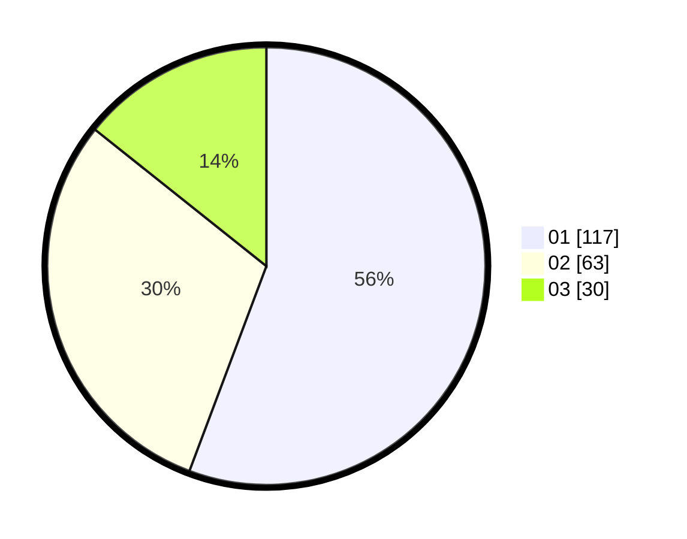

# Hasil

Hasil perolehan suara paslon dapat dilihat pada file paslon-01.txt, paslon-02.txt, dan paslon-03.txt.

Jika tidak ada, artinya data tersebut belum ada pada SIREKAP.

## Perolehan Suara

 * Paslon 01: **117**.
 * Paslon 02: **63**.
 * Paslon 03: **30**.

## Foto C Plano

https://sirekap-obj-formc.kpu.go.id/a687/pemilu/ppwp/31/74/08/10/04/3174081004015-20240214-200239--d90c8b9c-0fda-4e18-aad5-2e92a2891c5b.jpg

https://sirekap-obj-formc.kpu.go.id/a687/pemilu/ppwp/31/74/08/10/04/3174081004015-20240214-200318--9ab46c87-c89b-41ac-913f-7c1ee827ecd4.jpg

https://sirekap-obj-formc.kpu.go.id/a687/pemilu/ppwp/31/74/08/10/04/3174081004015-20240214-200348--37a85b38-a98d-4cbe-adb6-dc4920f85042.jpg

## DATA PEMILIH TETAP

Jumlah pemilih dalam DPT: **244**.
 * L: **121**.
 * P: **123**.

## DATA PENGGUNA HAK PILIH

Jumlah pengguna hak pilih dalam DPT: **193**.
 * L: **92**.
 * P: **101**.

Jumlah pengguna hak pilih dalam DPTb: **4**.
 * L: **4**.
 * P: **0**.

Jumlah pengguna hak pilih dalam DPK: **15**.
 * L: **5**.
 * P: **10**.

Jumlah pengguna hak pilih: **212**.
 * L: **101**.
 * P: **111**.

## JUMLAH SUARA SAH DAN TIDAK SAH

JUMLAH SELURUH SUARA SAH: **210**.

JUMLAH SUARA TIDAK SAH: **2**.

JUMLAH SELURUH SUARA SAH DAN SUARA TIDAK SAH: **212**.
